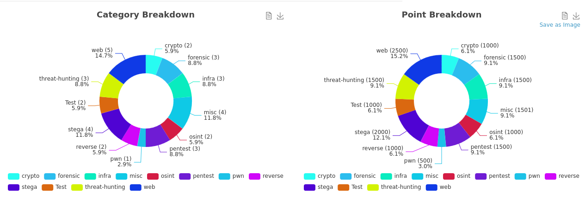

    <h1>24h IUT 2025 - Cyber</h1>
    
    

This repository contains the challenges and infrastructure elements for the [24h IUT 2025](https://24hinfo.iut.fr/).

## Challenges

| Type          | Release | Category                                    | Name                                                            | Difficulty | Status   | ChallMaker   |
|---------------|---------|---------------------------------------------|-----------------------------------------------------------------|------------|----------|--------------|
| `dynamic`     | T0      | [Crypto](challenges/crypto)                 | [Mr Vernam](challenges/crypto/vernam/)                          | Easy       | Ready    | PandatiX     |
| `dynamic`     | T0      | [Crypto](challenges/crypto)                 | [Shamir le chat](challenges/crypto/shamir/)                     | Medium     | Ready    | PandatiX     |
| `dynamic`     | T0      | [Misc](challenges/misc)                     | [Memes 1/3](challenges/misc/memes_1/)                           | Easy       | Ready    | FireFlan     |
| `dynamic`     | T0      | [Misc](challenges/misc)                     | [Bottle Flip Challenge](challenges/misc/bottle-flip-challenge/) | Easy       | Ready    | WildPasta    |
| `standard`    | T+7     | [Misc](challenges/misc)                     | [RETEX](challenges/misc/retex/)                                 | Easy       | Ready    | WildPasta    |
| `dynamic_iac` | T0      | [Infra](challenges/infra)                   | [Kubrac](challenges/infra/kubrac/)                              | Hard       | Ready    | PandatiX     |
| `dynamic`     | T0      | [Forensic](challenges/forensic)             | [Layers](challenges/forensic/layers/)                           | Easy       | Ready    | PandatiX     |
| `dynamic`     | T0      | [Forensic](challenges/forensic)             | [SodaStream](challenges/forensic/sodastream/)                   | Medium     | Ready    | WildPasta    |
| `dynamic`     | T0      | [Forensic](challenges/forensic)             | [The Vault Dweller](challenges/forensic/the-vault-dweller/)     | Hard       | Ready    | WildPasta    |
| `dynamic_iac` | T0      | [Pentest](challenges/pentest)               | [Beverage Bazaar](challenges/pentest/beverage-bazaar/)          | Easy       | Ready    | WildPasta    |
| `dynamic_iac` | T0      | [Pentest](challenges/pentest)               | [Fatal Request](challenges/pentest/fatal-request/)              | Medium     | Ready    | WildPasta    |
| `dynamic_iac` | T0      | [Pentest](challenges/pentest)               | [L'illusionniste](challenges/pentest/illusionniste/)            | Medium     | Ready    | fr4gments    |
| `dynamic_iac` | T0      | [Pwn](challenges/pwn)                       | [Ret2PopaCola](challenges/pwn/ret2popacola/)                    | Medium     | Ready    | Souehda      |
| `dynamic`     | T0      | [Reverse](challenges/reverse)               | [Freizh Exam](challenges/reverse/freizh-exam/)                  | Easy       | Ready    | WildPasta    |
| `dynamic`     | T+4     | [Reverse](challenges/reverse)               | [Reverse The Duck](challenges/reverse/Reverse_The_Duck/)        | Easy       | Ready    | Cya3gha      |
| `dynamic`     | T+4     | [Stega](challenges/stega)                   | [Le Planqué 2](challenges/stega/le-planque-2/)                  | Easy       | Ready    | PandatiX     |
| `dynamic`     | T0      | [Stega](challenges/stega)                   | [OH DÉDÉ](challenges/stega/oh-dede/)                            | Easy       | Ready    | WildPasta    |
| `dynamic`     | T0      | [Stega](challenges/stega)                   | [Memes 2/3](challenges/stega/memes_2/)                          | Medium     | Ready    | FireFlan     |
| `dynamic`     | T0      | [Stega](challenges/stega)                   | [Memes 3/3](challenges/stega/memes_3/)                          | Hard       | Ready    | FireFlan     | 
| `dynamic`     | T0      | [Threat Hunting](challenges/threat-hunting) | [ColAPT 1/4](challenges/threat-hunting/1_ColaAPT/)              | Medium     | Ready    | hashp4       |
| `dynamic`     | T0      | [Threat Hunting](challenges/threat-hunting) | [ColAPT 2/4](challenges/threat-hunting/2_ColAPT/)               | Easy       | Ready    | hashp4       |
| `dynamic`     | T0      | [Threat Hunting](challenges/threat-hunting) | [ColAPT 3/4](challenges/threat-hunting/3_ColAPT/)               | Easy       | Ready    | hashp4       |
| `dynamic`     | T0      | [OSINT](challenges/osint)                   | [ColAPT 4/4](challenges/osint/4_ColAPT/)                        | Medium     | Ready    | hashp4       |
| `dynamic`     | T+4     | [OSINT](challenges/osint)                   | [Voyage, Voyage](challenges/osint/voyage-voyage/)               | Medium     | Ready    | hashp4       |
| `dynamic_iac` | T0      | [Web](challenges/web)                       | [WordPressure](challenges/web/wordpressure/)                    | Medium     | Ready    | WildPasta    |
| `dynamic_iac` | T+4     | [Web](challenges/web)                       | [Sticky Match](challenges/web/sticky-match/)                    | Medium     | Ready    | WildPasta    |
| `dynamic_iac` | T0      | [Web](challenges/web)                       | [Intern-Work](challenges/web/Intern-Work/)                      | Easy       | Ready    | BadZ_        |
| `dynamic_iac` | T0      | [Web](challenges/web)                       | [BlogCola 1/2](challenges/web/blog_cola_1_2/)                   | Easy       | Ready    | Walbre       |
| `dynamic_iac` | T0      | [Web](challenges/web)                       | [BlogCola 2/2](challenges/web/blog_cola_2_2/)                   | Medium     | Ready    | Walbre       |

The following challenges were not played during the event due to infrastructure issues.

| Type          | Release | Category                                    | Name                                                            | Difficulty | Status   | ChallMaker   |
|---------------|---------|---------------------------------------------|-----------------------------------------------------------------|------------|----------|--------------|
| `dynamic`     | T+4     | [Misc](challenges/misc)                     | [Turbo Timer](challenges/misc/turbo-timer/)                     | Easy       | Ready    | WildPasta    |
| `dynamic_iac` | T0      | [Infra](challenges/infra)                   | [Entrainement](challenges/infra/entrainement/)                  | Hard       | Ready    | KlemouLeZoZo |
| `dynamic_iac` | T+4     | [Infra](challenges/infra)                   | [CronpaCola](challenges/infra/cronpa-cola/)                     | Insane     | Ready    | KlemouLeZoZo |

    

### Team

- Admin
  - [PandatiX](https://github.com/pandatix)
  - [NicoFgrx](https://github.com/NicoFgrx)
  - [WildPasta](https://github.com/wildpasta)
- Ops
  - [PandatiX](https://github.com/pandatix)
  - [NicoFgrx](https://github.com/NicoFgrx)
  - [WildPasta](https://github.com/wildpasta)
- ChallMaker
  - [PandatiX](https://github.com/pandatix) (Infra, Crypto)
  - [WildPasta](https://github.com/wildpasta) (Misc, Web, Pentest, Reverse, Forensic, Stega)
  - [KlemouLeZoZo](https://kleman.pw/) (Windows)
  - [hashp4](https://x.com/hashp4_) (Threat Hunting, OSINT)
  - [Cya3gha](https://github.com/Cya3gha) (Reverse)
  - [Souehda](https://github.com/Souehda) (Pwn)
  - [FireFlans](https://github.com/FireFlans) (Misc, Stega)
  - [fr4gments](https://github.com/fr4gments) (Pentest)
  - [BadZ_](https://github.com/BadZzzzzzzz) (Web)
  - [Walbre](https://github.com/Walbre) (Web)

### Classification

Flag format: `24HIUT{...}`

Scoring:
- Score: **500** per challenge
- Decay: **26** (floor(2/3 of #players) = floor(40*2/3) = floor(26.6))
- Minimum: **100**

Difficulties:
- **Easy**: introduction level, everyone should be able to complete under 2 hours (with hints)
- **Medium**: require some knowledges, potentially acquired during the event with previous challenges
- **Hard**: require previous knowledges and creativity to solve
- **Insane**: require complex skills (might not be solved under 8 hours)

> [!NOTE]
> The 24h IUT 2025 targets BAC+1 to BAC+3 students, with mostly no previous experience in the field of cybersecurity.
> The event start at friday 2PM, then 8 hours of algorithmic challenges, 8 hours of web development, and 8 hours for the CTF (saturday 6AM-2PM).
>
> This must be considered in the difficulty rating by the ChallMaker. If any question, please contact Admins.

Status:
- **Incoming**
- **Review**
- **Ready**

## Timeline

- `23/05/2025 14h00` DEBEX + algo/prog begin
- `23/05/2025 18h00` memes.24hiut2025.ctfer.io (a taunt for misc/memes challenges)
- `23/05/2025 22h00` web begin
- `24/05/2025 02h00` start all shared instances + define pools min/max
- `24/05/2025 03h00` start each pool one by one
- `24/05/2025 05h00` reminder to use the cable network
- `24/05/2025 05h23` fatal error in the infrastructure, decision is made to reinstall all K8s production environment
- `24/05/2025 06h00` origin cyber begin
- `24/05/2025 06h30` cyber begins
- `24/05/2025 10h00` add second wave of challenges
- `24/05/2025 13h00` add misc/RETEX challenge + hide scoreboard
- `24/05/2025 14h00` FINEX
- `24/05/2025 14h30` prizes
- `24/05/2025 15h00` leaving site (must be before 17h00)
