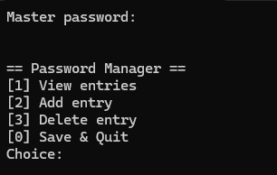

# WRITE-UP 

Nous avons deux fichiers à analyser :

- Une capture de RAM de l'ordinateur du CTO de PopaCola
- Un binaire servant à gérer des mots de passe (d'après l'énoncé)

## Analyse mémoire (part 1)

On commence par identifier l'image mémoire qui nous a été donnée :

```bash
vol -f DESKTOP-VTIHOVH-20250426-132242.raw windows.info
```

On scanne les processus lancés sur la machine :

```bash
vol -f DESKTOP-VTIHOVH-20250426-132242.raw windows.pslist.PsList
[SNIP]
2800	948	    FileCoAuth.exe	0xd58bfd541080	2	-	1	False	2025-04-26 12:15:53.000000 UTC	N/A	Disabled
9352	7992	msedge.exe	0xd58bfd459080	10	-	1	False	2025-04-26 12:16:14.000000 UTC	N/A	Disabled
9424	948	    RuntimeBroker.	0xd58bfe471080	3	-	1	False	2025-04-26 12:16:15.000000 UTC	N/A	Disabled
8	    7992	msedge.exe	0xd58bfd7e1080	17	-	1	False	2025-04-26 12:27:36.000000 UTC	N/A	Disabled
2736	5300	Notepad.exe	0xd58bfe0e6080	22	-	1	False	2025-04-26 12:32:05.000000 UTC	N/A	Disabled
4732	5300	pcola-vault-ma	0xd58bfcc7e080	1	-	1	False	2025-04-26 12:37:52.000000 UTC	N/A	Disabled
10236	4732	conhost.exe	0xd58bfbfb8080	2	-	1	False	2025-04-26 12:37:52.000000 UTC	N/A	Disabled
6684	948	    OpenConsole.ex	0xd58bfd9f5080	7	-	1	False	2025-04-26 12:37:52.000000 UTC	N/A	Disabled
[SNIP]
```

On voit que le **pcola-vault-manager** donné en input du challenge est lancé sur la machine.
C'est ce processus qui contient notre flag.

## Analyse du binaire

On peut lancer le binaire pour voir ce qu'il fait (dans une VM c'est mieux).

Il s'agit d'un simple gestionnaire de mot de passe qui prend en entrée un fichier **.passdb** dans lequel on peut :

- voir les entrées
- ajouter une entrée
- supprimer une entrée
- sauvegarder et quitter



Une fois que le fichier a été écrit, les mots de passe enregistrés ont bien été *chiffrés* dans le fichier.


Un comportement étonnant que l'on peut remarquer en jouant avec le binaire est que l'on ne peut pas ouvrir le fichier **test.passdb** lorsqu'il est en cours d'édition par **pcola-vault-manager**.


Cela veut dire que si un fichier est ouvert par notre gestionnaire de mots de passe, un **handle** est conservé dessus et si on dump la mémoire du processus, on peut récupérer le contenu du fichier chiffré **.passdb** actuellement ouvert.
Cela se vérifie facilement avec l'utilitaire [Systeminformer](https://systeminformer.com/).


## Décompilation du gestionnaire de mot de passe

Mais alors comment fonctionne le processus de chiffrement des secrets sur cette application ?

Le binaire n'est pas strippé ni optimisé ce qui facilite son analyse dans IDA.

La logique de ce premier bloc est assez simple, on peut voir que le vault prend en entrée un fichier avec l'extension `.passdb`, qu'il le lit en mémoire et qu'il demande un mot de passe pour le déchiffrer.


Dans la suite du code décompilé, on peut voir que notre mot de passe est encodé en base64 puis utilisé pour XOR le fichier lu dans la première étape.


Pour déchiffrer un fichier traité par ce gestionnaire, on peut utiliser le snippet suivant :

```python
import base64

def xor_decode(data, key):
    # Repeat the key to match the length of the data
    key = (key * (len(data) // len(key))) + key[:len(data) % len(key)]
    # XOR the data with the key
    decoded = bytearray(a ^ b for a, b in zip(data, key))
    return decoded

def decode_file(file_path, password):
    # Base64 encode the password
    base64_password = base64.b64encode(password.encode()).decode()

    # Read the encoded file
    with open(file_path, 'rb') as file:
        encoded_data = file.read()

    # Decode the file content
    decoded_data = xor_decode(encoded_data, base64_password.encode())

    # Write the decoded data to a new file
    decoded_file_path = file_path + '.decoded'
    with open(decoded_file_path, 'wb') as file:
        file.write(decoded_data)

    print(f"Decoded file saved as {decoded_file_path}")

file_path = 'encoded_file.passdb'
password = 'your_master_password'
decode_file(file_path, password)
```

## Analyse mémoire (part 2)

### Récupération du fichier passdb

Maintenant qu'on a davantage d'informations sur le fonctionnement du **pcola-vault**, on dump le contenu du processus de la capture mémoire.

```bash
vol -f DESKTOP-VTIHOVH-20250426-132242.raw windows.dumpfiles.DumpFiles --pid 4732
---
[SNIP]
DataSectionObject	0xd58bfd077a20	windows.storage.dll.mui	Error dumping file
DataSectionObject	0xd58c02b4a090	popacola.passdb	file.0xd58c02b4a090.0xd58c03610100.DataSectionObject.popacola.passdb.dat
SharedCacheMap	0xd58c02b4a090	popacola.passdb	file.0xd58c02b4a090.0xd58bff824560.SharedCacheMap.popacola.passdb.vacb
[SNIP]
```

On a récupéré un fichier **popacola.passdb** qui est une base de mot de passe ouverte par notre application.
Nous n'avons plus qu'à trouver où son mot de passe se trouve.

### Password Hunting

On avait vu un processus *notepad.exe* plus haut et si on le dump on récupère ce qui nous intéresse.

```bash
vol -f DESKTOP-VTIHOVH-20250426-132242.raw windows.dumpfiles.DumpFiles --pid 2736
---
[SNIP]
DataSectionObject	0xd58c03e2dc10	R000000000006.clb	Error dumping file
DataSectionObject	0xd58c03e056c0	1743ed46-d349-4695-a3e4-b3148aecab16.bin	file.0xd58c03e056c0.0xd58c00cba240.DataSectionObject.1743ed46-d349-4695-a3e4-b3148aecab16.bin.dat
SharedCacheMap	0xd58c03e056c0	1743ed46-d349-4695-a3e4-b3148aecab16.bin	file.0xd58c03e056c0.0xd58bfd4d3870.SharedCacheMap.1743ed46-d349-4695-a3e4-b3148aecab16.bin.vacb
DataSectionObject	0xd58bfd06d480	461036df-241d-4b85-8a32-a036a4ead270.1.bin	file.0xd58bfd06d480.0xd58bfd7c6440.DataSectionObject.461036df-241d-4b85-8a32-a036a4ead270.1.bin.dat
SharedCacheMap	0xd58bfd06d480	461036df-241d-4b85-8a32-a036a4ead270.1.bin	file.0xd58bfd06d480.0xd58bfc8b4010.SharedCacheMap.461036df-241d-4b85-8a32-a036a4ead270.1.bin.vacb
[SNIP]
```

Le format des fichiers *.bin* récupérés correspond en fait aux **Tabstate** de Notepad sur les dernières versions de W11.
Ils permettent de garder en mémoire (en réalité dans `C:\Users\popa-user\AppData\Local\Packages\Microsoft.WindowsNotepad_*\LocalState\TabState` ) les onglets ouverts dans Notepad mais pas sauvegardés en tant que fichiers par l'utilisateur.

Des outils existent pour parser ces fichiers mais dans notre cas un simple coup de `xxd` nous permet d'en visualiser le contenu.


On apprend que le mot de passe utilisé pour chiffrer notre base de mot de passe est en fait `ReznJBiLbCbuJp54xVv7`.

### Déchiffrement de la base passdb

On réutilise le script que l'on a écrit plus haut pour déchiffrer la base :

```bash
# on change les paramètres
file_path = 'file.0xd58c02b4a090.0xd58c03610100.DataSectionObject.popacola.passdb.dat'
password = 'ReznJBiLbCbuJp54xVv7'
```


## Référence

- https://github.com/AbdulRhmanAlfaifi/notepad_parser
