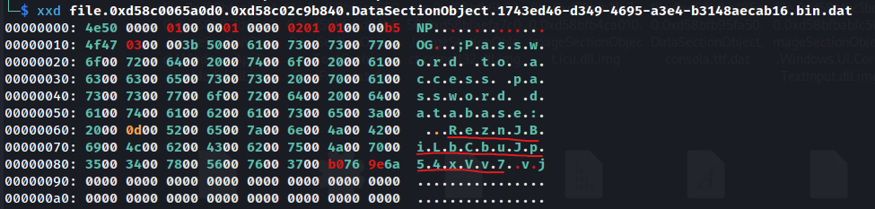

# WRITE-UP 

Nous avons deux fichiers à analyser :

- Une capture de RAM de l'ordinateur du CTO de PopaCola
- Un binaire servant à gérer des mots de passe (d'après l'énoncé)

## Analyse mémoire (part 1)

On commence par identifier l'image mémoire qui nous a été donnée :

```bash
# On identifie que c'est une image Windows avec file 
file DESKTOP-VTIHOVH-20250429-155900.raw
---
DESKTOP-VTIHOVH-20250429-155900.raw: Windows Event Trace Log
```

```bash
# On récupère quelques informations sur l'image
vol -f DESKTOP-VTIHOVH-20250429-155900.raw windows.info
```

On scanne les processus lancés sur la machine :

```bash
vol -f DESKTOP-VTIHOVH-20250429-155900.raw windows.pslist
---
PID	    PPID	ImageFileName	Offset(V)	Threads	Handles	SessionId	Wow64	CreateTime	ExitTime	File output
[SNIP]
2696	7992	msedge.exe	    0xd58bfe1820c0	16	-	1	False	2025-04-29 15:47:23.000000 UTC	N/A	Disabled
5844	796	    svchost.exe 	0xd58bfcbac0c0	11	-	0	False	2025-04-29 15:47:41.000000 UTC	N/A	Disabled
6728	2240	audiodg.exe	    0xd58bfb9eb080	8	-	0	False	2025-04-29 15:47:43.000000 UTC	N/A	Disabled
11816	5300	Notepad.exe	    0xd58bfd9f0080	17	-	1	False	2025-04-29 15:58:38.000000 UTC	N/A	Disabled
1832	5300	pcola-vault-mg	0xd58bfc427080	15	-	1	False	2025-04-29 15:58:43.000000 UTC	N/A	Disabled
11132	1832	conhost.exe	    0xd58bffc48080	6	-	1	False	2025-04-29 15:58:43.000000 UTC	N/A	Disabled
4500	948	    OpenConsole.ex	0xd58bffd94080	11	-	1	False	2025-04-29 15:58:43.000000 UTC	N/A	Disabled
[SNIP]
```

On voit que le **pcola-vault-manager.exe** donné en input du challenge est lancé sur la machine.
C'est ce processus qui contient notre flag.

## Analyse du binaire

Malgré l'avertissement en énoncé, on peut essayer de lancer le binaire (dans une VM c'est mieux).

Il s'agit d'un simple gestionnaire de mot de passe qui prend en entrée un fichier **.passdb** dans lequel on peut :

- voir les entrées
- ajouter une entrée
- supprimer une entrée
- sauvegarder et quitter


On ne peut pas vraiment interagir avec puisque le binaire crash de manière aléatoire.

Cependant, on remarque un comportement étonnant en jouant avec le binaire : on ne peut pas ouvrir le fichier **test.passdb** lorsqu'il est en cours d'édition par **pcola-vault-manager.exe**.


Cela veut dire que si un fichier est ouvert par notre gestionnaire de mots de passe, un **handle** est conservé dessus et si on dump la mémoire du processus, on peut récupérer le contenu du fichier chiffré **.passdb** actuellement ouvert.
Cela se vérifie facilement avec l'utilitaire [Systeminformer](https://systeminformer.com/).


## Décompilation du gestionnaire de mot de passe

Mais alors comment fonctionne le processus de chiffrement des secrets sur cette application ?

Le binaire n'est pas strippé ni optimisé ce qui facilite son analyse dans IDA.

La logique de ce premier bloc est assez simple, on peut voir que le vault prend en entrée un fichier avec l'extension `.passdb`, qu'il le lit en mémoire et qu'il demande un mot de passe pour le déchiffrer.


Dans la suite du code décompilé, on peut voir que notre mot de passe est encodé en base64 puis utilisé pour XOR le fichier lu dans la première étape.


Pour déchiffrer un fichier traité par ce gestionnaire, on peut utiliser le snippet suivant :

```python
import base64

def xor_decode(data, key):
    # Repeat the key to match the length of the data
    key = (key * (len(data) // len(key))) + key[:len(data) % len(key)]
    # XOR the data with the key
    decoded = bytearray(a ^ b for a, b in zip(data, key))
    return decoded

def decode_file(file_path, password):
    # Base64 encode the password
    base64_password = base64.b64encode(password.encode()).decode()

    # Read the encoded file
    with open(file_path, 'rb') as file:
        encoded_data = file.read()

    # Decode the file content
    decoded_data = xor_decode(encoded_data, base64_password.encode())

    # Write the decoded data to a new file
    decoded_file_path = file_path + '.decoded'
    with open(decoded_file_path, 'wb') as file:
        file.write(decoded_data)

    print(f"Decoded file saved as {decoded_file_path}")

file_path = 'encoded_file.passdb'
password = 'your_master_password'
decode_file(file_path, password)
```

On peut voir que le binaire est complètement explosé dans la suite du code décompilé.
C'est ça qui cause les crash de l'application.


## Analyse mémoire (part 2)

### Récupération du fichier passdb

Maintenant qu'on a davantage d'informations sur le fonctionnement de **pcola-vault-manager**, on dump le contenu du processus de la capture mémoire.

```bash
vol -f DESKTOP-VTIHOVH-20250429-155900.raw windows.dumpfiles --pid 1832
---
[SNIP]
DataSectionObject	0xd58c00643330	user32.dll.mui	Error dumping file
DataSectionObject	0xd58c00668810	popacola.passdb	file.0xd58c00668810.0xd58c03610100.DataSectionObject.popacola.passdb.dat
SharedCacheMap	    0xd58c00668810	popacola.passdb	file.0xd58c00668810.0xd58bf85de010.SharedCacheMap.popacola.passdb.vacb
DataSectionObject	0xd58c02e0bde0	StaticCache.dat	Error dumping file

[SNIP]
```

On a récupéré un fichier **popacola.passdb** qui est une base de mot de passe ouverte par notre application.
La base est illisible en l'état et nous devons trouver comment la déchiffrer.

### Password Hunting

Si on prend un peu de recul sur la situation, on peut voir qu'un processus *notepad.exe* a été lancé cinq minutes avant la création de notre gestionnaire de mots de passe.
Il se trouve que si on le dump on récupère un fichier qui nous intéresse.

```bash
vol -f DESKTOP-VTIHOVH-20250429-155900.raw windows.dumpfiles --pid 11816
---
[SNIP]
DataSectionObject	0xd58c02e08410	461036df-241d-4b85-8a32-a036a4ead270.0.bin	Error dumping file
SharedCacheMap	    0xd58c02e08410	461036df-241d-4b85-8a32-a036a4ead270.0.bin	file.0xd58c02e08410.0xd58bfb9064d0.SharedCacheMap.461036df-241d-4b85-8a32-a036a4ead270.0.bin.vacb
DataSectionObject	0xd58c00659450	461036df-241d-4b85-8a32-a036a4ead270.1.bin	file.0xd58c00659450.0xd58bfd7c6440.DataSectionObject.461036df-241d-4b85-8a32-a036a4ead270.1.bin.dat
SharedCacheMap	    0xd58c00659450	461036df-241d-4b85-8a32-a036a4ead270.1.bin	file.0xd58c00659450.0xd58bfbd439e0.SharedCacheMap.461036df-241d-4b85-8a32-a036a4ead270.1.bin.vacb
DataSectionObject	0xd58c0065a0d0	1743ed46-d349-4695-a3e4-b3148aecab16.bin	file.0xd58c0065a0d0.0xd58c02c9b840.DataSectionObject.1743ed46-d349-4695-a3e4-b3148aecab16.bin.dat
SharedCacheMap	    0xd58c0065a0d0	1743ed46-d349-4695-a3e4-b3148aecab16.bin	file.0xd58c0065a0d0.0xd58bfd7d8cd0.SharedCacheMap.1743ed46-d349-4695-a3e4-b3148aecab16.bin.vacb
DataSectionObject	0xd58c0065d460	KernelBase.dll.mui	                        file.0xd58c0065d460.0xd58bfa7b3470.DataSectionObject.KernelBase.dll.mui.dat

[SNIP]
```

Le format des fichiers *.bin* récupéré correspond aux **Tabstate** de Notepad sur les dernières versions de W11.
Ils permettent de garder en mémoire (en réalité dans `C:\Users\popa-user\AppData\Local\Packages\Microsoft.WindowsNotepad_*\LocalState\TabState`) les onglets ouverts dans Notepad mais pas sauvegardés en tant que fichiers par l'utilisateur.

Des outils existent pour parser ces fichiers mais dans notre cas un simple coup de `xxd` nous permet de visualiser rapidement son contenu.



On apprend que le mot de passe utilisé pour chiffrer notre base de mots de passe est en fait `ReznJBiLbCbuJp54xVv7`.

> Note : si on utilise `cat` pour afficher le contenu du fichier, le contenu sera mal parsé par le binaire. On n'aura donc pas le contexte qui nous dit qu'il s'agit du mot de passe de la base de mots de passe.

### Déchiffrement de la base passdb

On réutilise le script que l'on a écrit plus haut pour déchiffrer la base :

```bash
# on change les paramètres
file_path = 'file.0xd58c00668810.0xd58c03610100.DataSectionObject.popacola.passdb.dat'
password = 'ReznJBiLbCbuJp54xVv7'
```


## Référence

- https://github.com/AbdulRhmanAlfaifi/notepad_parser
- https://www.youtube.com/watch?v=zSSBbv2fc2s
