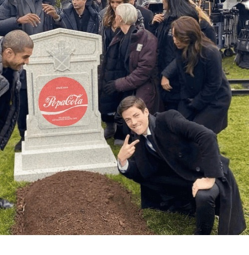
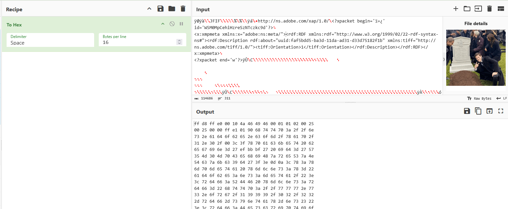
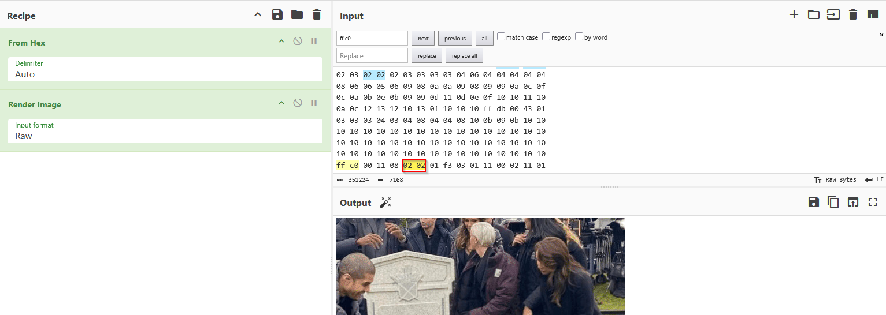
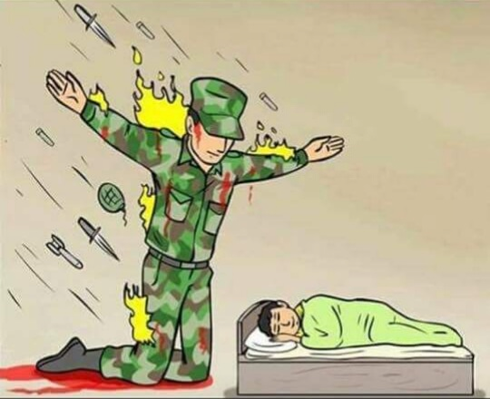
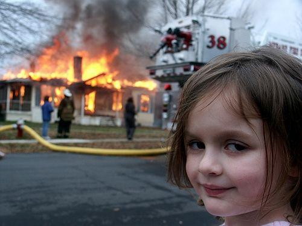
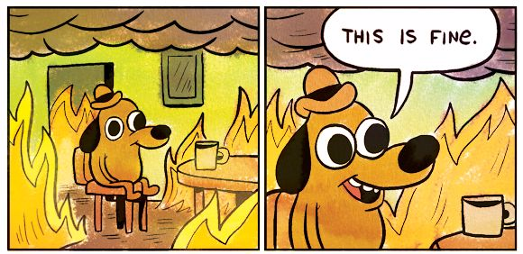
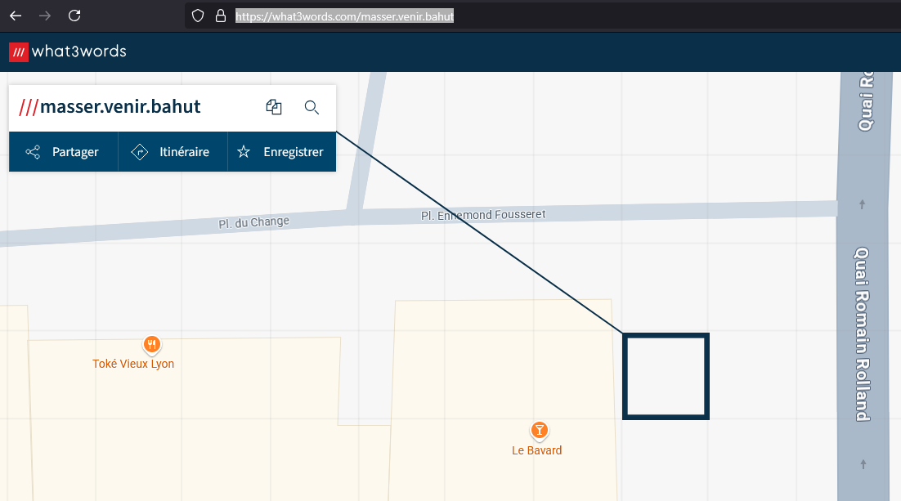
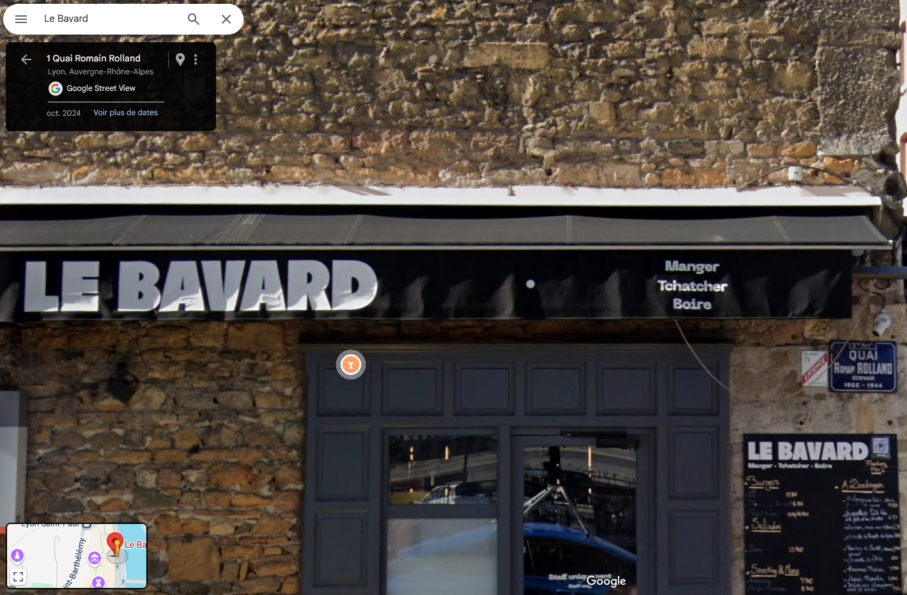

# Write Up Challenges Memes

### Partie 1

Difficulty : ???

#### Énoncé

*Popa Pola n'a pas l'air d'avoir bonne réputation en ligne, des rigolos se sont amusés à faire un site de memes pour vous garder motivés pendant votre sabotage.*  
*Bien qu'il paraisse anodin, le fouiller pourrait vous rapporter des points*

URL : memes.24hiut25.ctfer.io

##### Hint #1 : Quand on doit fouiller, c'est fouiller
##### Hint #2 : On peut en cacher des choses dans du CSS

#### Résolution

Dans le code source, il y a l'import suivant : 
```html
<!-- Specific -->
<link rel='stylesheet' type='text/css' media='screen' href='resources/css/24hiut.css'>
````
En suivant le lien, le fichier contient uniquement la ligne suivante 
````
/*24HIUT{d2115cebcdc909b185a7cbe1050ef233d45e8bf9f5f367cca104e38c893897de}*/
````
FLAG : __24HIUT{d2115cebcdc909b185a7cbe1050ef233d45e8bf9f5f367cca104e38c893897de}__

### Partie 2

Difficulty : ???

#### Énoncé

*Visiblement, ce site pourrait bien vous rapporter des points pour la suite.*  
*L'un de vos objectifs est "d'enterrer Popa Pola", peut être y a-t-il quelque chose sous sa tombe ...*  

##### Hint #1 : Fouillez littéralement sous la tombe
##### Hint #2 : Une image peut en cacher une autre 
##### Hint #3 : Les metadonnées, c'est comme son historique : ça se modifie 

#### Résolution

Explications techniques ici : ````https://cyberhacktics.com/hiding-information-by-changing-an-images-height````  

Tout d'abord, trouver l'image de la tombe Popa Pola : ````resources/templates/images/3nx72a.jpg````  


L'ouvrir dans Cyberchef, la convertir en hexadécimal :



Passer l'hexadécimal en input, reconvertir en image et localiser la séquence ````ff c0````, la taille est encodée 3 bytes plus loin:



Augmenter la taille à la main puis scroller sur l'image:


FLAG : __24HIUT{3nTeRR0nS_P0p4_P0L4}__

### Partie 3

Difficulty : ???

#### Énoncé

*Cette fois-ci c'est sûr, des infos sont planquées pour vous aider.*  
*Votre supérieur vous parle d'une phrase étrange prononcée par vos commanditaires:*  

*"On ne devrait pour vous le dire, mais le RSSI de Popa Pola va souvent dans le même bar. Cherchez les petits détails dans les flammes et vous pourrez le trouver facilement. Envoyez nous la devise du lieu et on vous confirmera l'information."*  

*Finalement le renseignement humain est peut-être aussi efficace qu'une cyber attaque en bonne et due forme, en plus ça sera l'occasion de boire un coup sur votre temps de travail*

Format du flag : __24HUIT{devise_du_lieu}__

##### Hint #1 : Il y a 3 templates avec des flammes
##### Hint #2 : Certaines informations on un poids plus faible que d'autres
##### Hint #3 : Comment relier 3 mots à un lieu ?

#### Résolution

Tout d'abord, trouver les 3 images contenant des flammes :  
1. ````resources/templates/images/2tzo2k.png````
2. ````resources/templates/images/23ls.png````
3. ````resources/templates/images/wxica.png````





La partie suivante de l'énoncé permet de se mettre sur la voie :  
``` Cherchez les petits détails ```
Il faut en fait extraire les LSB des couleurs Green, Red et Blue pour trouver les mots, possible de faire ça avec des outils online comme : https://georgeom.net/StegOnline/upload
Il suffit d'upload les images, de se balader dans les bits planes :

Les 3 analyses donnent les mots : 
1. masser
2. venir
3. bahut
Pour trouver le lieu associé : https://what3words.com/masser.venir.bahut


Petit tour du propriétaire en Street View:



FLAG : __24HIUT{manger_tchatcher_boire}__
