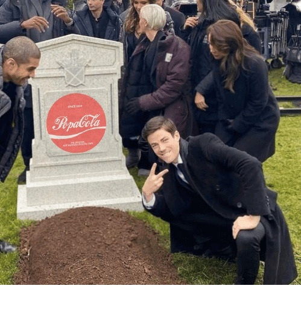
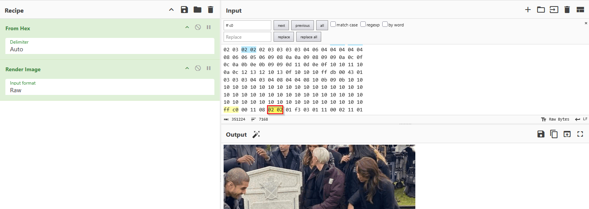
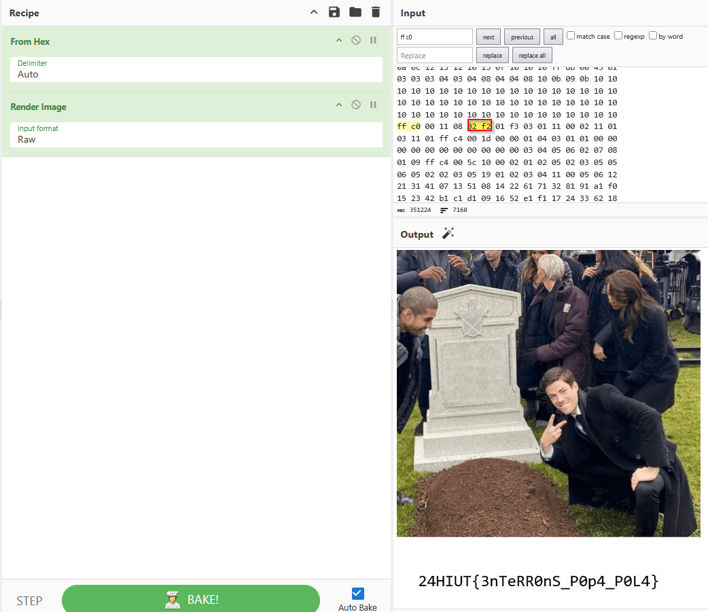

## Memes 2/3

Explications techniques [ici](https://cyberhacktics.com/hiding-information-by-changing-an-images-height)

Tout d'abord, trouver l'image de la tombe Popa Pola : `resources/templates/images/3nx72a.jpg`

L'ouvrir dans Cyberchef, la convertir en hexadécimal :

Passer l'hexadécimal en input, reconvertir en image et localiser la séquence `ff c0`, la taille est encodée 3 bytes plus loin:

Augmenter la taille à la main puis scroller sur l'image :

FLAG : `24HIUT{3nTeRR0nS_P0p4_P0L4}`
