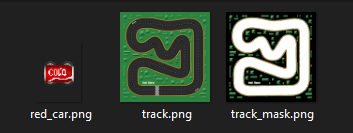
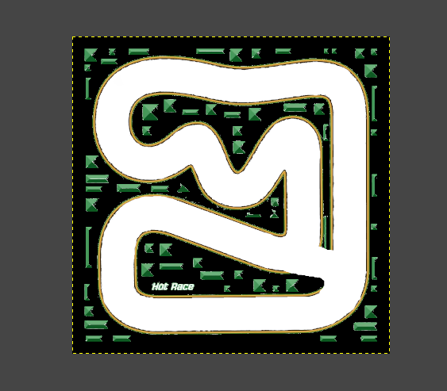
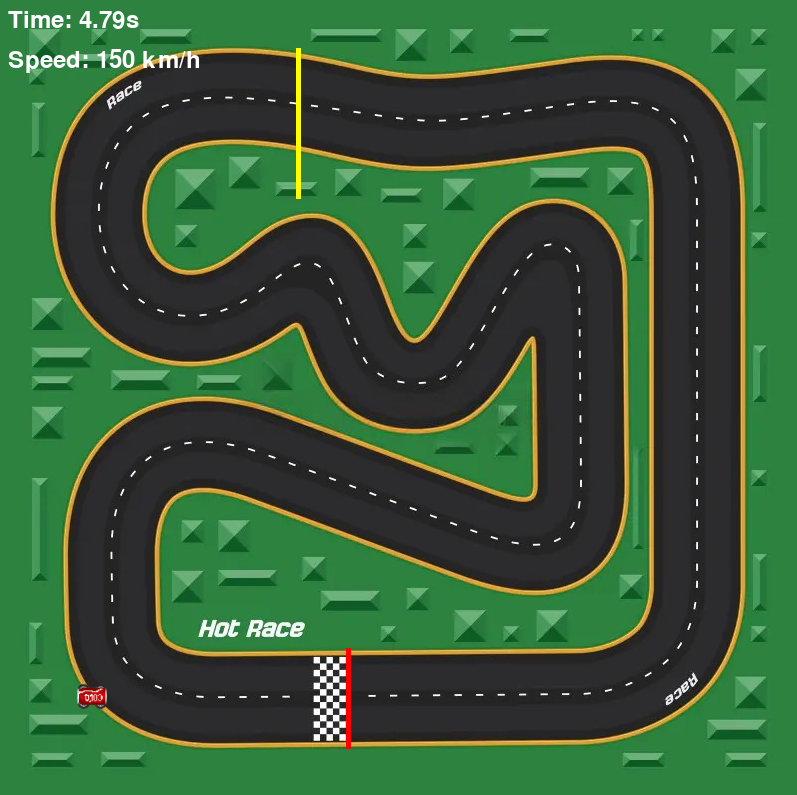
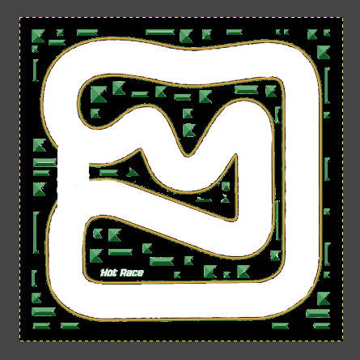

# Write-Up - Misc / Turbo Timer

On est face à un petit jeu développé en Python avec Pygame, protégé par Pyarmor pour obfusquer le code source.

Étant donné la difficulté annoncée (Easy), il est peu probable que l'on doive désobfusquer le script pour résoudre le challenge. 
On s’oriente donc directement vers une approche de type black-box.

## Analyse des fichiers

Les autres fichiers à notre disposition sont des ressources du jeu, à savoir : une image pour la voiture, une image pour le circuit et ce qui apparaît être le masque du circuit utilisé pour déterminer les zones "roulables" ou non.

## Objectif du challenge

Le but est simple : franchir la ligne d'arrivée en moins de 10 secondes pour afficher un flag.

## Modification du masque

L'idée initiale est de modifier le masque (*track_mask.png*) pour permettre à la voiture de rouler hors piste, en traçant un raccourci direct vers la ligne d'arrivée.

Cependant, une fois la ligne franchie… rien ne se passe. Le jeu ne détecte pas la fin de course. 🤔

## Système de checkpoint

À force d’expérimenter, on découvre qu’il ne suffit pas de franchir la ligne d’arrivée : il faut d’abord passer par un checkpoint, probablement pour éviter les raccourcis évidents (en jaune sur le screen ci-dessous).

On réédite donc le masque en incluant une trajectoire sur mesure qui passe d'abord par le checkpoint, puis fonce vers l'arrivée.

Cette fois, ça fonctionne ! 🎉
On termine la course en moins de 10 secondes et le flag s'affiche.

