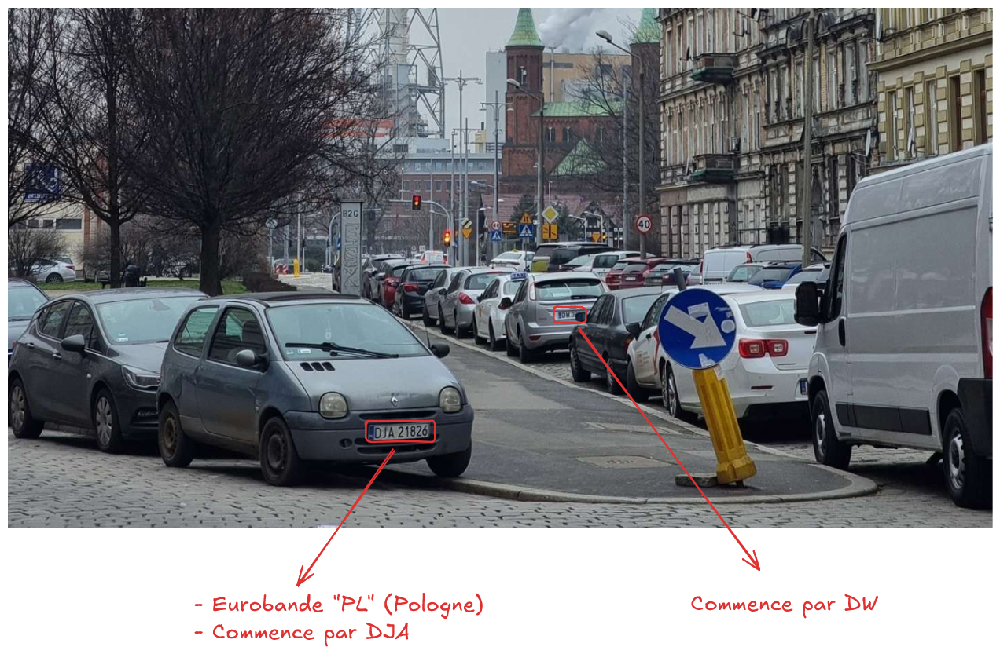
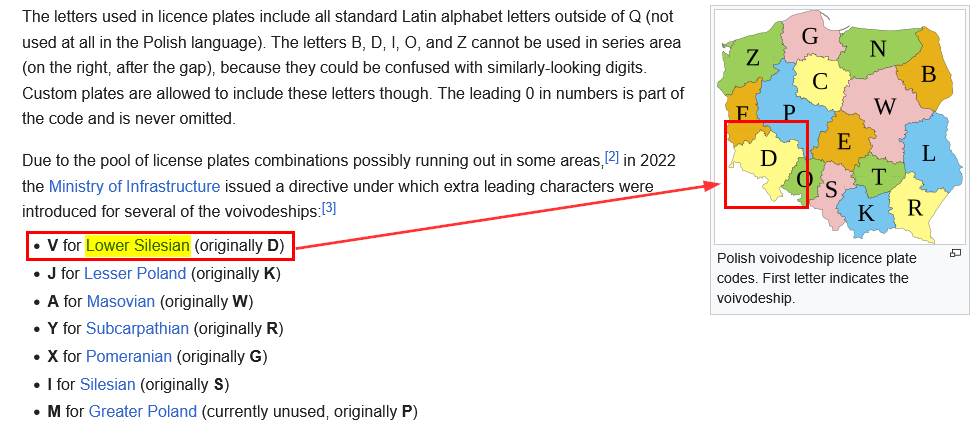
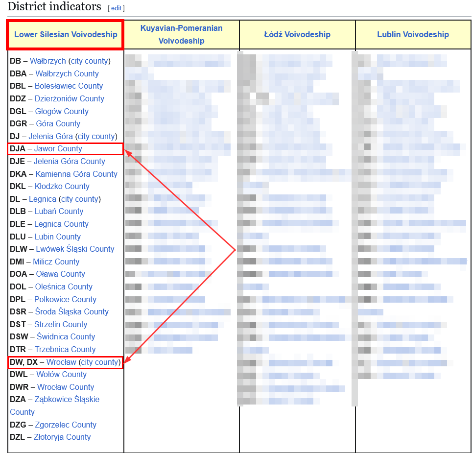
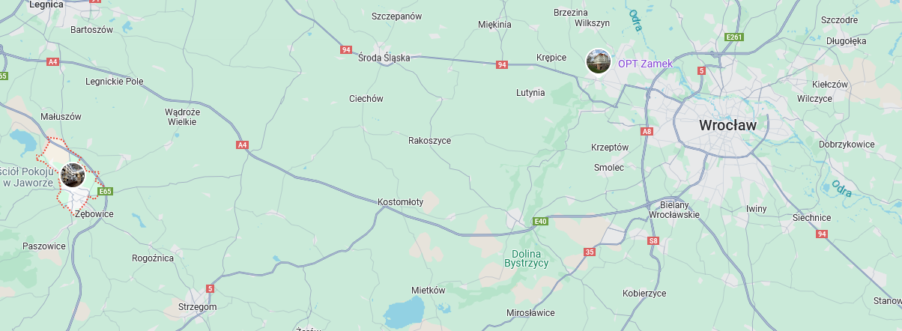
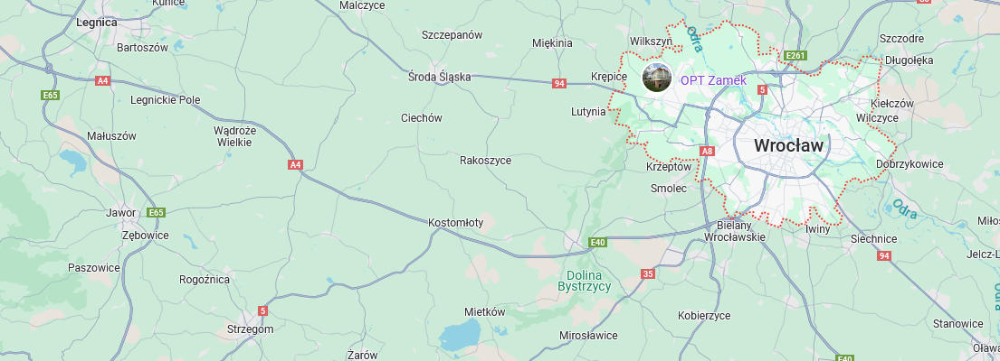
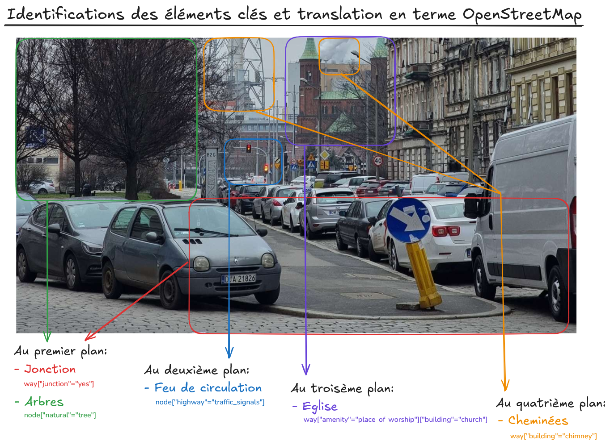
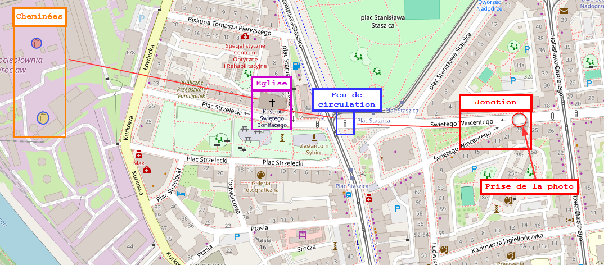
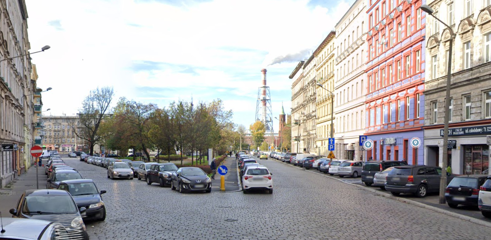
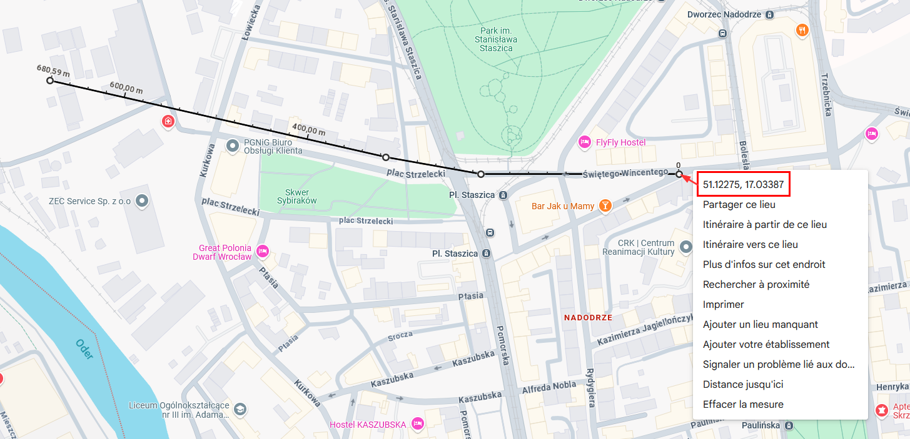

# Solution - Voyage, voyage

Outils préférables pour la résolution du challenge :
- `Wikipedia - Vehicle registration plates of Poland` - https://en.wikipedia.org/wiki/Vehicle_registration_plates_of_Poland 
- `OpenStreetMap Wiki - Map features` - https://wiki.openstreetmap.org/wiki/Map_features
- `Overpass Turbo` - https://overpass-turbo.eu
- `Google Maps` - https://maps.google.com/

## 1. Réduction de la zone de recherche 

Pour commencer, il est essentiel de réduire notre zone de recherche. Pour ce faire, on peut se servir des plaques d'immatriculations présentes sur la photo. On peut en identifier 2 de manière claire :



Les éléments que l'on peut extraire de ces plaques d'immatriculations:
- L'eurobande (coté bleu à gauche) de la plaque de la Twingo au premier plan indique "PL". Le pays est donc probablement la Pologne.
- Cette même plaque commence par les lettres `DJA`
- La plaque au second plan commence quant à elle par `DW`.

Maintenant, il faut pouvoir exploiter ces informations. Il faut donc se renseigner sur le format des plaques d'immatriculation polonaises. Pour ça, des sites dédiés existent, mais Wikipedia est amplement suffisant dans le cadre de ce challenge.



On apprends que la première lettre définit l'équivalent de la région. Les deux plaques commencent par un D, correspondant à la région `Lower Silesian`. 



Les lettres suivantes quant à elles servent à définir le district (l'équivalent de la ville). Dans notre cas, il s'agit soit de `Jawor`, soit de `Wrocław`





En comparant la superficie des deux villes, on remarque tout de suite que Wrocław est bien plus grande. Au vue de la densité d'éléments sur la photo et prenant en compte le contexte du challenge (ouverture d'une nouvelle usine), il est logique de s'orienter vers la ville la plus grande.

*(Cela étant dit, ce n'est pas obligatoire de déduire cette information mais cela facilite les recherches et permet de gagner du temps)*

## 2. Extraction des éléments de l'image et translation en features OpenStreetMap

Maintenant que l'on a réduit la zone de recherche à une ville, il va falloir trouver l'emplacement exact de cette photo. C'est là qu'Overpass Turbo est très utile. C'est un outil permettant de requêter l'API d'OpenStreetMap de manière "user-friendly" (faut le dire vite, le format des requêtes n'est pas le plus intuitif ni sexy à utiliser). Mais le gros point fort de l'outil est de permettre à l'utilisateur de faire des corrélations entre les différentes features.

En effet, OpenStreetMap définit ce qu'il appelle des "features" et qui permettent d'identifier de manière très précise divers éléments (routes, jardins, bâtiments, objets, etc). Donc, il faut à présent extraire différents éléments de la photo et trouver leur correspondances en features OpenStreetMap. Ainsi, on pourra créer une requête qui nous aidera à trouver l'emplacement recherché.



On peut découper l'image en différents plans et extraire les éléments intéressants :
- au premier plan, on dénote une jonction en forme de V (en rouge) et des arbres (en vert) ;
- au deuxième plan, on observe un feu de signalisation (en bleu) ;
- au troisième plan, on devine ce qui semble ressembler à une église (en violet - une recherche inversée sur la photo le confirme) ;
- au quatrième plan, de la fumée et une infrastructure qui ressemble à une cheminée d'usine (en orange).

Désormais, on peut traduire ces différents éléments en features OpenStreetMap:
- les arbres sont: `node["natural"="tree"]` ;
- les jonctions sont: `way["junction"="yes"]` ;
- les feux de signalisations sont: `node["highway"="traffic_signals"]` ;
- les églises sont: `way["amenity"="place_of_worship"]["building"="church"]` ;
- les cheminées sont: `way["building"="chimney"]`.

Il ne reste "plus qu'à" construire la requête Overpass Turbo. Pour ce faire, il faudra également estimer à vue d'oeil la distance entre les différents éléments, d'où la découpe de l'image en plusieurs plans...

## 3. Construction de la requête Overpass Turbo

Il n'existe pas de solution unique, mais la requête suivante est plutôt précise, avec un taux de faux positif plutôt bas.

```json
/*
Requête pour trouver l'emplacement de la cheminée par rapport
aux autres éléments (arbres, jonction, feux de ciruclation et église)

Les distances sont estimées et approximatives.
*/
[out:json][timeout:500];

//On définit la ville
area["name"~"Wrocław"]->.boundaryarea;

//Création d'un noeud correspondant à la feature "arbre", présent dans la ville
node["natural"="tree"](area.boundaryarea)->.trees;

//On définit l'ensemble des jonctions qui se trouvent dans un rayon de 50 mètres d'un arbre
way["junction"="yes"](area.boundaryarea)(around.trees:50)->.junctions;

//On définit l'ensemble des feux de signalisations qui se trouvent dans un rayon de 200 mètres de ces jonctions
node["highway"="traffic_signals"](area.boundaryarea)(around.junctions:200)->.traffic_lights;

//On définit l'ensemble des églises qui se trouvent dans un rayon de 100 mètres de ces feux de signalisations
way["amenity"="place_of_worship"]["building"="church"](area.boundaryarea)(around.traffic_lights:100)->.churches;

//On définit l'ensemble des cheminées qui se trouvent dans un rayon de 400 mètres de ces églises
way["building"="chimney"](area.boundaryarea)(around.churches:400)({{bbox}});

//On affiche le résultat - l'emplacement de ces cheminées
out geom;
```

Voici le résultat que l'on obtient sur la carte:



Ici, j'ai rajouté une légende qui permet d'identifier les différents éléments que l'on a pu extraire au préalable. On retrouve ainsi plutôt simplement la fameuse jonction en forme de V à partir de laquelle la photo semble avoir été prise. On peut vérifier ça à travers Google Street View via Google Maps:



Il suffit ensuite d'en extraire les coordonnées...




## Flag

Le flag final est donc le suivant: `24HIUT{51.122, 17.033}`.
