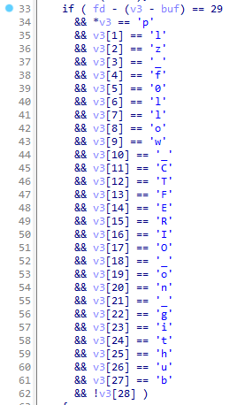

# Write-Up - Reverse / Freizh Exam

On ouvre le binaire dans le désassembleur de votre choix, ici on utilisera IDA.

On atterri directement dans la seule fonction du programme : `start`.

On peut voir que le contenu de `/proc/self/cmdline` est lu par `sys_read`.

Ensuite, une série de xor est effectuée en cascade avec deux options à la fin, un message d'échec et un autre de félicitations :

Il faut donc que la chaîne que l'on passe à notre commandline soit identique à celle comparée par la logique du binaire pour gagner.

Le code décompilé ressemble à ça :

Lorsque l'on converti les valeurs hexadécimale en caractère, on voit notre flag apparaître :

On le passe en argument de notre commande et le message de réussite apparaît !

