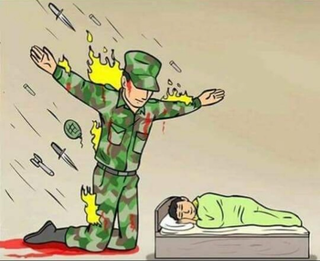
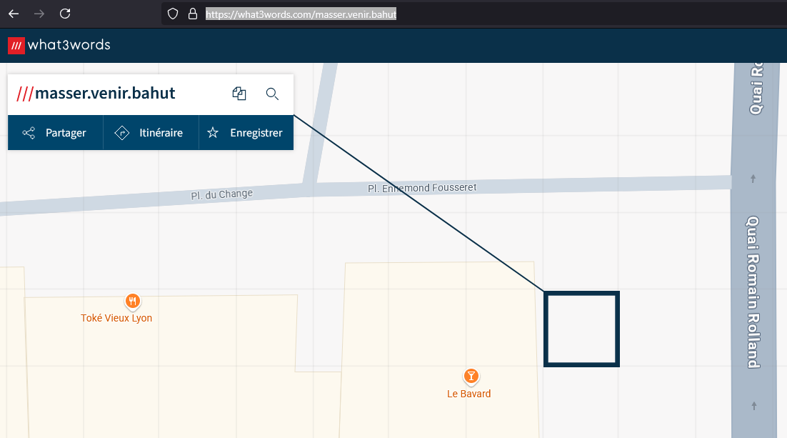

## Write-Up - Stega / Memes 3/3

Tout d'abord, trouver les 3 images contenant des flammes :  
1. `resources/templates/images/2tzo2k.png`
2. `resources/templates/images/23ls.png`
3. `resources/templates/images/wxica.png`

La partie suivante de l'énoncé permet de se mettre sur la voie : `Cherchez les petits détails`.
Il faut en fait extraire les LSB des couleurs Green, Red et Blue pour trouver les mots, possible de faire ça avec des outils online comme [StegOnline](https://georgeom.net/StegOnline/upload).

Il suffit d'upload les images, de se balader dans les bits planes :

Les 3 analyses donnent les mots : 
1. masser
2. venir
3. bahut

Pour trouver le lieu associé : https://what3words.com/masser.venir.bahut

Petit tour du propriétaire en Street View:

FLAG : `24HIUT{manger_tchatcher_boire}`
