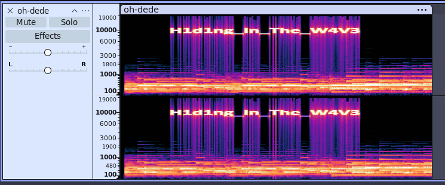

# Write-Up - Stega / Oh Dédé

Il s'agit d'un challenge de stéganographie bien connu dans lequel on cache une information dans un fichier audio (ici un `.mp3`).

On peut s'apercevoir à l'écoute qu'il y a des grésillements sur la piste audio.

Pour découvrir ce qu'il se cache derrière ce fichier, on doit l'ouvrir dans Audacity et afficher le spectrogramme de l'audio.

