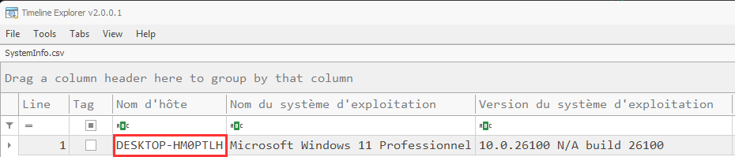
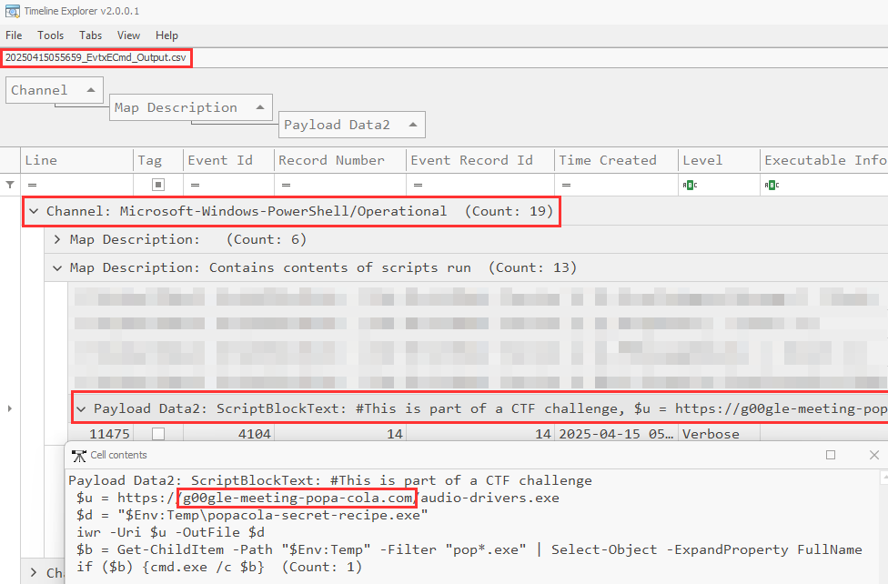
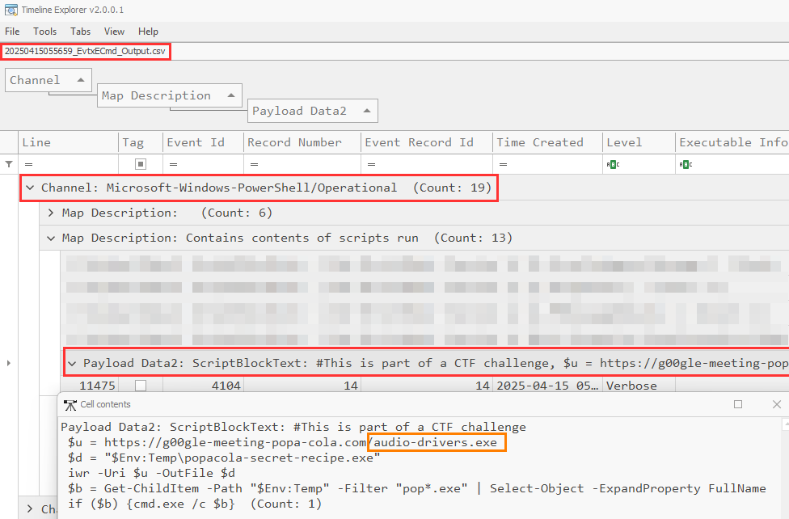
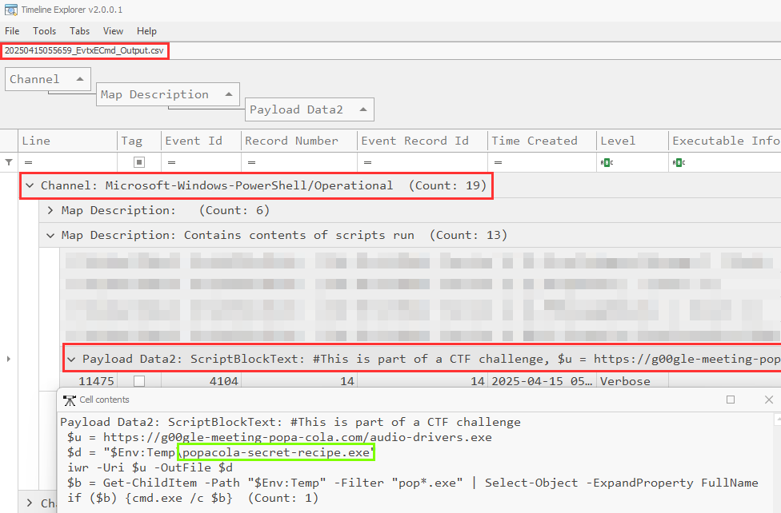
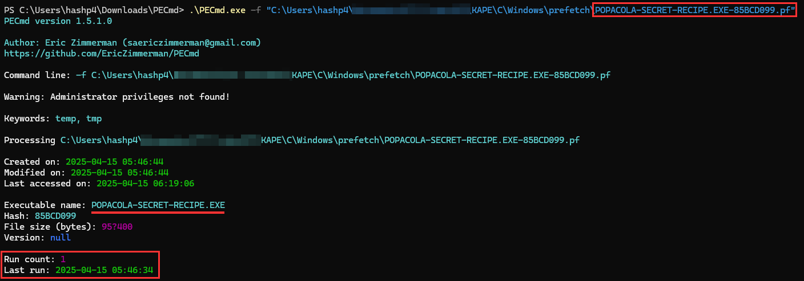
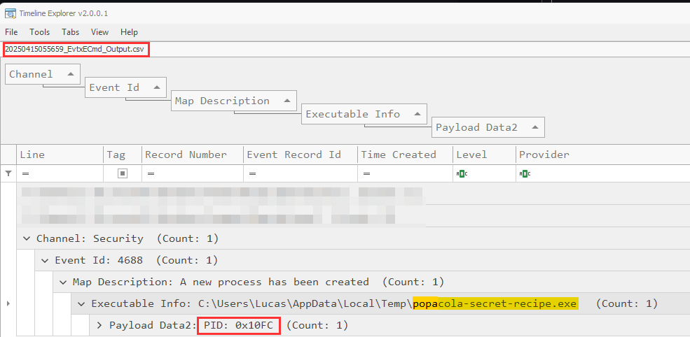
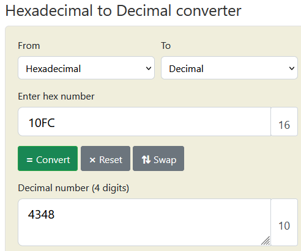

# Solution - ColAPT (1/4) - Analyse et investigation
Outils préférables (bien que facultatifs) pour la résolution du challenge:
- `Timeline Explorer` par Eric Zimmerman
- `PECmd` par Eric Zimmerman

https://ericzimmerman.github.io/#!index.md

## 1. Trouver le nom d'hôte (hostname) du l'ordinateur infecté
L'information est présente au sein de plusieurs artifacts. Le plus simple étant de consulter le fichier suivant: `artifacts\parsed\LiveResponse\SystemInfo.csv` qui regroupe les informations système.

Réponse: `DESKTOP-HM0PTLH`

## 2. Trouver le nom de domaine malveillant utilisé pour la distribution du malware

Encore une fois, l'information est présente au sein de plusieurs artifacts. Un des moyens d'obtenir l'information est d'utiliser le fichier `artifacts\parsed\EventLogs\20250415055659_EvtxECmd_Output.csv` qui regroupe la plupart des évènements Windows de la machine.

Ce qui nous intéresse ici, c'est l'exécution de commandes/scripts Powershell. Le channel permettant de les consulter se nomme `Microsoft-Windows-Powershell/Operational`. Dans la colonne `Payload Data2`, il est possible de voir en détail ce qui a été executé sur la machine.  

On remarque assez rapidement qu'un script Powershell semble intéressant. Au sein de celui-ci, la variable `$u` contient le nom de domaine malveillant utilisé pour distribuer le malware. La variable est utilisée en tant qu'argument par `iwr` (alias de Invoke Web-Request) pour télécharger le fichier et l'enregistrer sur le disque en tant que `popacola-secret-recipe.exe` dans le répertoire `C:\Users\Lucas\AppData\Local\Temp\` de l'utilisateur.

Réponse: `g00gle-meeting-popa-cola.com`

## 3. Trouver le nom original du malware

Il est possible de résoudre cette question à l'aide de la même source d'information de la partie 2:

Le binaire servi par le domaine malveillant est prénommé `audio-drivers.exe`, un prétexte utilisé par l'attaquant pour prétendre être un exécutable permettant d'installer des drivers audios aux yeux de la victime.

Réponse: `audio-drivers.exe`

## 4. Trouver le nouveau nom du malware après sauvegarde sur le disque

Il est possible de résoudre cette question à l'aide de la même source d'information de la partie 2:

Le binaire susmentionné est sauvegardé en tant que `popacola-secret-recipe.exe` sur la machine, avant d'être executé. 

Réponse: `popacola-secret-recipe.exe`

## 5. Trouver le timestamp associé à l'exécution du malware (format AAAA-MM-DD HH:mm:ss)

De nouveau, l'information peut-être présente au sein de plusieurs artifacts. Un des moyens d'obtenir l'information est d'utiliser le fichier Prefetch correspondant à l'exécutable en question. En investigation numérique (forensics), ces fichiers permettent d'attester d'une preuve d'exécution sur une machine. Ils se trouvent dans le répertoire `C:\Windows\prefetch`. Dans notre cas, le fichier prefetch correspondant au malware susmentionné est le suivant: `artifacts\C\Windows\prefetch\POPACOLA-SECRET-RECIPE.EXE-85BCD099.pf`

Il faut ensuite analyser le fichier pour en extraire les informations intéressantes. Par chance, Eric Zimmerman a développé un outil permettant de le faire, qui s'intitule PECmd. Il suffit de lui passer un fichier prefetch en argument pour obtenir le timestamp associé à la dernière exécution. 

Dans notre cas, comme le malware n'a été exécuté qu'une seule fois (champ `Run count = 1`), cela correspond donc au timestamp d'exécution du malware.

Réponse: `2025-04-15 05:46:34`

## 6. Trouver le PID associé à l'exécution du malware. 

L'information est présente au sein de l'évènement n° 4688 du channel `Sécurité`. Cet évènement correspond à la création d'un nouveau processus. De ce fait, il faut utiliser le fichier suivant: `artifacts\parsed\EventLogs\20250415055659_EvtxECmd_Output.csv`qui regroupe la plupart des évènements Windows de la machine. 

Pour une visualisation plus facile, il est préferable encore une fois d'utiliser Timeline Explorer.

Ici, le PID en stocké en hexadécimal. Il suffit donc de le convertir en valeur décimale. 

Réponse: `4348`

## Flag

Le flag final est donc le suivant: `24HIUT{DESKTOP-HM0PTLH:g00gle-meeting-popa-cola.com:audio-drivers.exe:popacola-secret-recipe.exe:2025-04-15 05:46:34:4348}`
