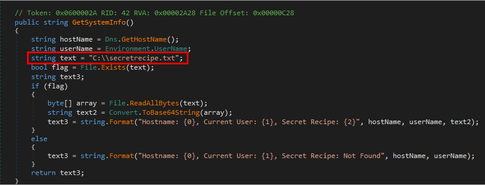
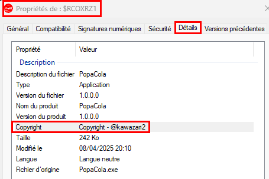

# Solution - ColAPT (3/4) - Analyse du malware
Outils préférables pour la résolution du challenge:
- `Detect It Easy` - https://github.com/horsicq/Detect-It-Easy
- `dnSpy` - https://github.com/dnSpyEx/dnSpy
- `strings` et un peu de guessing (oui, tout simplement... :p)

Je présente ici la méthode de résolution avec dnSpy. J'ai au préalable ouvert le malware avec.

## 1. Trouver l'URL contactée par le malware pour l'exfiltration

Comme le malware est écrit en .NET, la rétro-ingénierie est de ce fait bien plus simple et explicite. En listant les différentes classes, une sort particulièrement du lot: `SystemInfoSender`.

Cette classe semble disposer de plusieurs méthodes. Celle qui nous intéresse ici est la première de la liste, à savoir `SystemInfoSender()`. 

On remarque que la variable `domainUrl` semble contenir l'URL utilisée pour l'exfiltration. On peut obtenir la confirmation en regardant où est utilisée cette variable (`Clique-droit > Rechercher`). Il se trouve qu'elle est utilisée dans la méthode `SendDataAsync()` pour l'envoi des données à travers une requête HTTP utilisant la méthode POST.

Réponse: `http://c2.popacola.xyz:1337/ping` 

## 2. Trouver le fichier sensible que le malware souhaite exfiltrer

Pour trouver le fichier sensible à exfiltrer, il suffit d'inspecter la méthode `GetSystemInfo()`.

Cette méthode récolte plusieurs données différentes, à savoir:
- le nom d'hôte de la machine,
- le nom d'utilisateur dans le contexte d'exécution du malware,
- le fichier `secretrecipe.txt`, supposément présent à la racine du système de fichier.

Le contenu du fichier est lu et encodé en `base64`. Ce dernier constitue le fichier sensible en question.

Réponse: `secretrecipe.txt`

## 3. Trouver l'algorithme de chiffrement utilisé pour chiffrer les données

Pour trouver l'algorithme de chiffrement utilisé pour chiffrer les données, il faut analyser la méthode `EncryptData()`.

On observe ainsi que l'algorithme de chiffrement utilisé semble être `AES`.

Réponse: `AES`

## 4. Trouver la clé de chiffrement utilisée pour chiffrer les données

Pour trouver la clé de chiffrement utilisée pour chiffrer les données, il faut analyser la méthode `SendDataAsync()`.

Celle-ci contient la clé de chiffrement utilisée pour chiffrer les données récoltées au préalable par la méthode `Get SystemInfo()` avant de les envoyer au serveur de l'attaquant via une requête HTTP en utilisant la méthode POST.

Réponse: `rrq5sX2AhNfv9eJ`

## 5. Trouver le pseudo du développeur

Pour trouver le pseudo du développeur, il suffit de regarder les metadonnées du malware. 

Avec dnSpy par exemple:

Ou alors en ouvrant les propriétes du fichier, via Windows:

Réponse: `@kawazari2`

## Flag

Le flag final est donc le suivant: `24HIUT{http://c2.popacola.xyz:1337/ping:secretrecipe.txt:AES:rrq5sX2AhNfv9eJ:@kawazari2}`