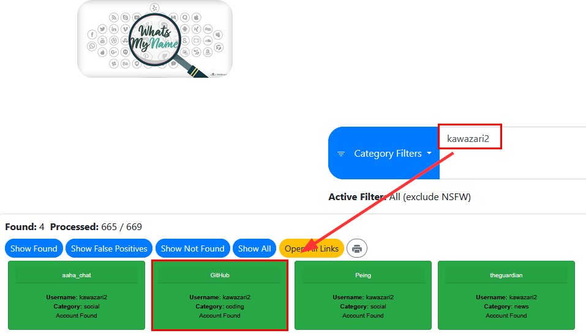
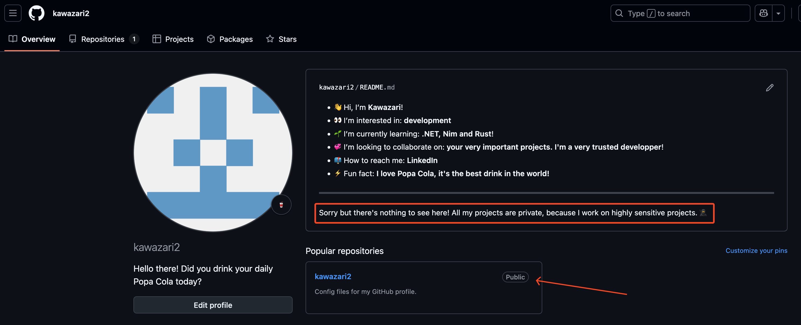
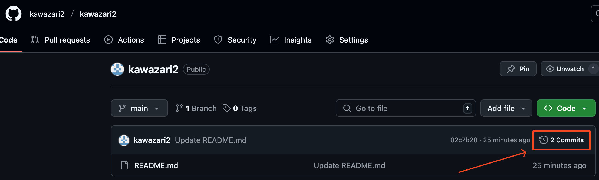
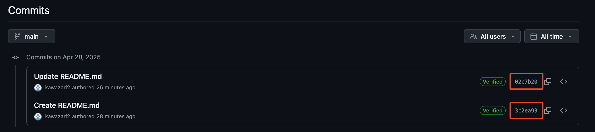
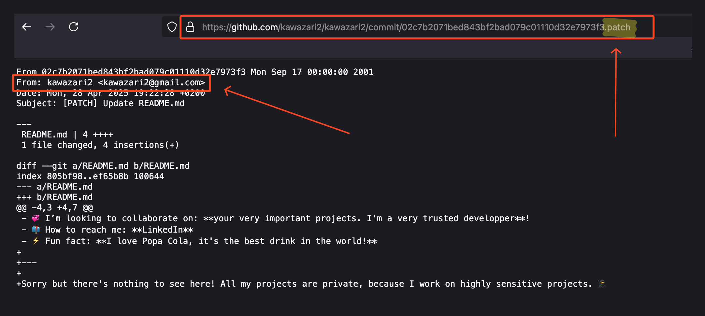
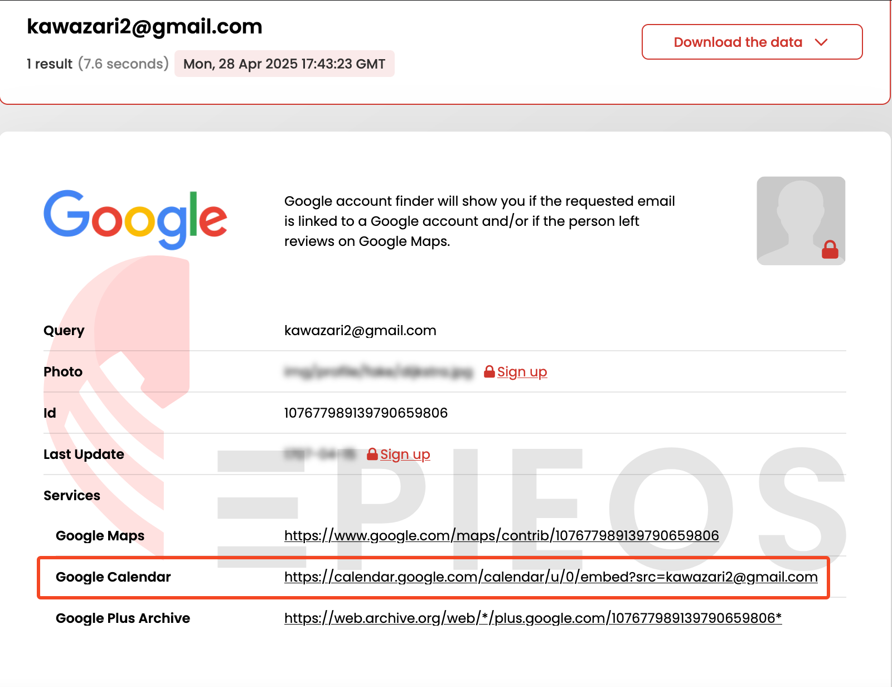
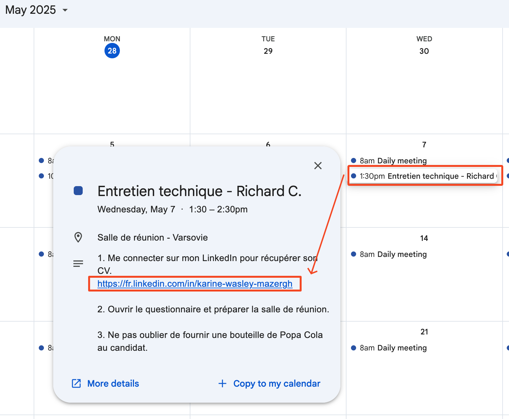
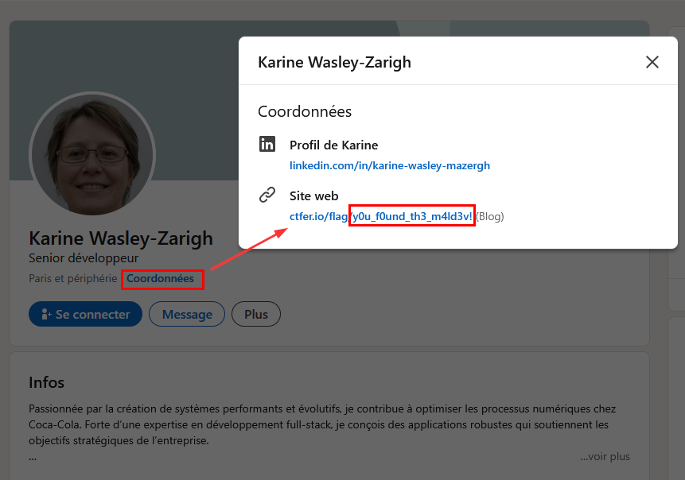

# Solution - ColAPT (4/4) - À la recherche du coupable
Outils préférables pour la résolution du challenge:
- `Whatsmyname` - https://whatsmyname.app/
- `EPIEOS` - https://epieos.com/
- `Google`
- `Github`
- `LinkedIn`

## 1. Investigation à partir du nom d'utilisateur

Lors du challenge précédent (`ColAPT (3/4) - Analyse du malware`), il était nécéssaire de trouver le pseudo du développeur du malware, malencontreusement laissé par celui-ci dans les métadonnées. Le pseudo est le suivant: `kawazari2`. 

À ce stade, il est possible de deviner que le développeur possède probablement un compte Github compte-tenu de sa position. Cependant, il est préférable d'utiliser un outil spécialisé dans la recherche de nom d'utilisateur pour en avoir la "certitude". Ici, j'utilise `Whatsmyname` qui est un outil en ligne assez populaire pour ce type de recherches.

Parmi les faux-positifs, on remarque un résultat intéressant: un compte Github avec le même nom d'utilisateur. Il est donc temps d'effectuer le premier pivot.

## 2. Premier pivot: Github

On remarque rapidement qu'il n'y a pas grand chose sur le profil Github, mais plusieurs indices prouvent que l'on est bien sur la bonne piste (mention de Popa Cola, développement en .NET, ...)

Bien que le développeur spécifie que ses repos sont privés, ce n'est pas le cas de son README. On peut donc potentiellement en savoir plus sur celui-ci à travers ses commits.

En cliquant sur l'un des deux commits puis en ajoutant l'extension `.patch` à l'URL, cela permet de voir le patch en question.

Celui-ci "leak" l'adresse email du développeur (`kawazari2@gmail.com`), qu'il va être possible d'utiliser pour le deuxième pivot.

## 3. Deuxième pivot: Google

Maintenant que l'on dispose de l'adresse email, il est possible d'utiliser l'outil `EPIEOS` pour tenter d'obtenir plus d'informations.

Parmi les informations à notre disposition, celle qui nous intéresse le plus est le calendrier Google de l'utilisateur puisqu'il est accessible au public. En observant attentivement les différents évènements, l'un d'entre eux semble intéressant: un entretien technique.

Le développeur semble avoir pris quelques notes au préalable de l'entretien, sûrement pour ne rien oublier. Par soucis de simplicité, il y a même laissé son LinkedIn pour pouvoir accéder rapidement au CV du candidat. De ce fait, on peut à présent pivoter sur son profil LinkedIn...

## 3. Troisème et dernier pivot: LinkedIn

En visitant le profil LinkedIn, on remarque la section `Coordonnées` qui contient souvent des informations supplémentaires sur les utilisateurs (e-mail, numéro de téléphone, blog...)

Ici, elle contient un `Site web` qui possède le flag dans l'URI, démontrant que l'on a bien réussi à retrouver la bonne personne. 

## Flag

Le flag final est donc le suivant: `24HIUT{y0u_f0und_th3_m4ld3v!}`