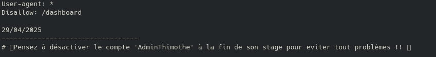
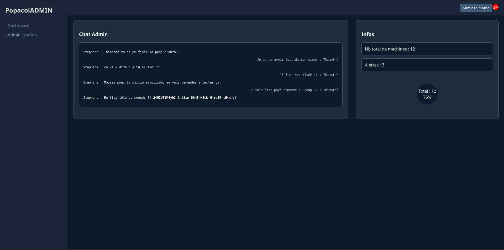

# Write-Up - Web / Intern Work

Pour ce challenge, nous avons un lien vers le site développé par le fameux stagiaire.
Une fois sur ce dernier, nous sommes confronté à une mire de connexion.


Face à ce genre de mire de connexion, deux idées sont à explorer :
- SQLi
- XSS

Face à un site aussi basique que ce dernier, on peut tenter les deux (l'intuition pointe vers une SQLi).

Malheureusement, si on essaye différentes payloads basiques dans les différents champs, tel que :
- `' or 1=1`
- `' or 1=1 --`
- `value' or 1=1`
- `value' or 1=1 --`
Rien n'opère et nous pouvons alors nous demander s'il ne faudrait pas mettre un user en particulier afin de pouvoir réussir notre injection.

Une feature connu sur les sites webs est le fameux `robots.txt`, un fichier situé à la racine du site web afin de référencer les pages qui ne doivent pas être indexées par les moteurs de recherche. Toutefois, certains usent de ce fichier afin d'y cacher des infos commentées.
(A noter qu'une des bonnes pratique est, de ne pas le rendre accessible).



Une fois le fichier lu/récupéré, nous observons un commentaire suggérant de supprimer le compte `AdminThimothe` à la fin de son stage, suspect non ? Essayons quelques payloads avec ce user.

### Résolution 1

```html
user:  AdminThimothe
password : ' or 1=1
result : DENIED

user : AdminThimothe
password : ' or 1=1 --
result : SUCCESS
```

### Résolution 2

```html
user : AdminThimothe' or 1=1
password : cequetuveux
result : DENIED

user : AdminThimothe' or 1=1 --
password : cequetuveux
result : SUCCESS
```
Avec les deux payloads fonctionnelles, nous sommes bien renvoyé sur la page `Dashboard`, page où nous pouvons observer la conversation entre Thimothe et ce qui semble être son Tuteur de stage, qui lui fournit le flag comme rémunération (skill issue 🦐).



Flag : `24HIUT{M4yb3_1nt3rn_D0nT_H4ck_H4rd3R_tH4n_U}`
