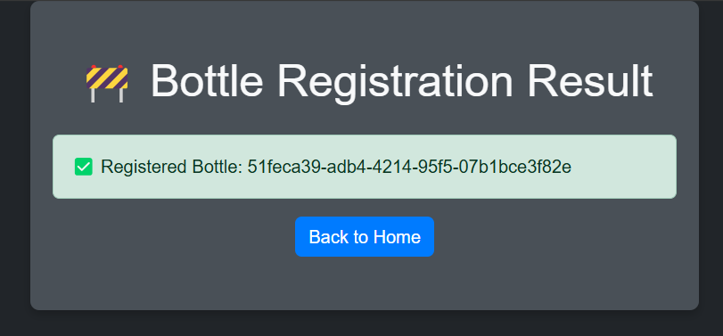
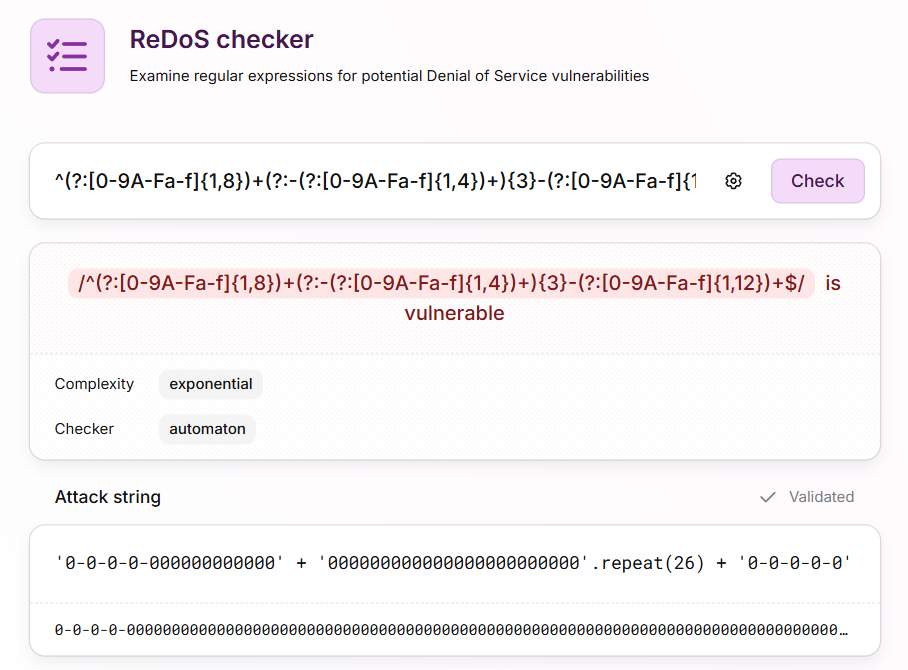
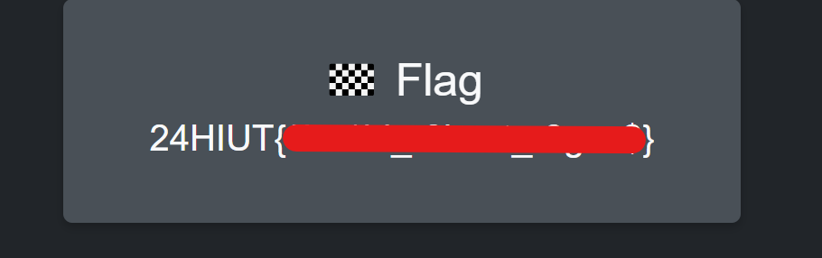

# WRITE-UP STICKY MATCH

## Fonctionnement nominal

L'application est un site permettant d'enregistrer des nouvelles bouteilles de Popa Cola.

Lorsque qu'on entre un GUID valide dans le formulaire et qu'on le valide, on a un retour :



En revanche, lorsque le GUID n'est pas valide, on a un message d'erreur qui nous est retourné.
Le site n'a pas l'air de cacher davantage de pages, hormis un endpoint `/stats` utilisé pour afficher la latence moyenne de nos requêtes.

## Recherche d'exploits

On peut se demander pourquoi un indicateur de latence est affiché sur cet applicatif...
Dans la console Devtools (F12), on peut voir apparaître des messages lorsque l'utilisateur soumet des entrées.

```bash
# GUID valide
Success - The bottle GUID was successfully registered.
# GUID invalide
Error - The bottle GUID must match the regex: ^(?:[0-9A-Fa-f]{1,8})+(?:-(?:[0-9A-Fa-f]{1,4})+){3}-(?:[0-9A-Fa-f]{1,12})+$
```

Cette regex paraît un peu suspecte et c'est notre meilleure piste jusqu'à maintenant.

## Exploitation ReDOS

La regex est bien notre vecteur d'attaque.

Elle est vulnérable à un ReDoS parce qu'elle utilise des quantificateurs imbriqués - des quantificateurs dans des quantificateurs (comme `(X+)+`) - qui créent un nombre exponentiel de chemins de correspondance possibles.

Les moteurs de regex utilisent le **backtracking** pour explorer tous les chemins de correspondance possibles en présence de quantificateurs.
Lorsqu'une correspondance échoue à un moment donné, le moteur « rembobine » pour essayer d'autres moyens de satisfaire les quantificateur antérieurs.

On va donc trouver vérifier notre théorie en allant sur un [vérificateur de regex](https://devina.io/redos-checker).
Il nous donne un input pour provoquer une attaque ReDOS.



On essaye donc de submit `0-0-0-0-0000000[SNIP]0000000-0-0-0-0` comme un GUID de bouteille et ça fonctionne !
Le site est injoignable et après quelques secondes d'attente, le flag apparaît sur la page d'accueil.



Morale de l'histoire, toujours vérifier ses regex.
