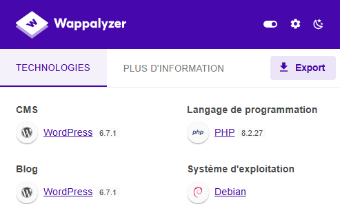
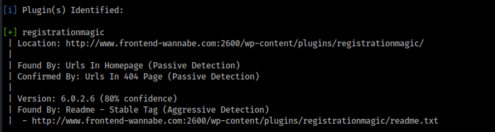
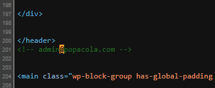
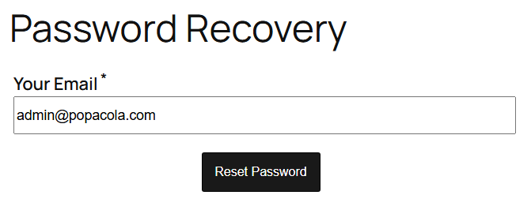
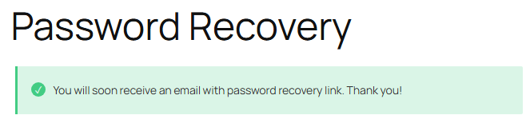
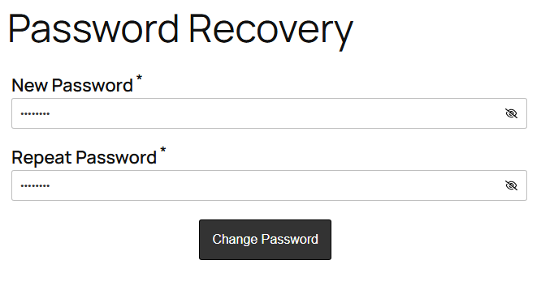
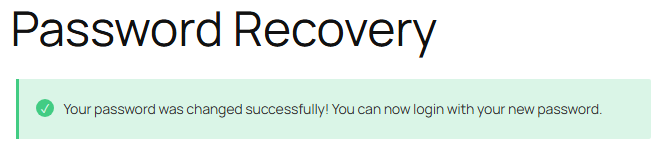
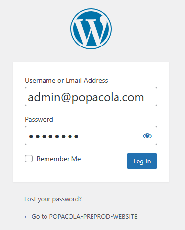
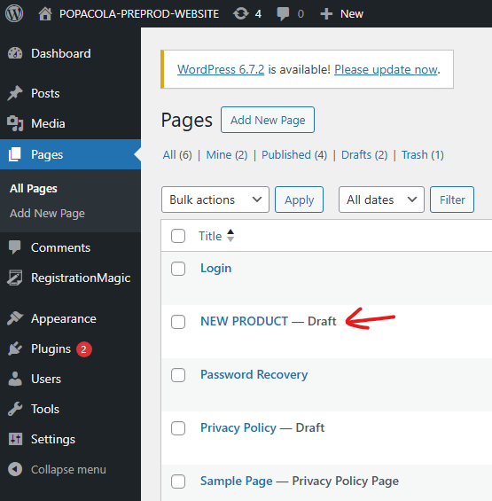

# Write-Up - Web / WordPressure

## Reconnaissance

La technologie utilisée est un serveur web Wordpress.
La page d'accueil suffit à nous l'indiquer mais on peut utiliser Wappalyser pour confirmer notre première intuition.



On peut donc commencer par scanner les vulnérabilités de ce site :

```bash
wpscan --url http://www.frontend-wannabe.com:2600 --enumerate ap
# OU AVEC
wpprobe scan --url http://www.frontend-wannabe.com:2600
```

La surface exposée du site est assez réduite mais un plugin retient notre attention `registrationmagic v6.0.2.6`.



Après quelques recherches de CVE en donnant le nom du plugin et sa version, on tombe sur un identifiant `CVE-2024-10508`.
Il s'agit d'une vulnérabilité introduite par le plugin qui ne valide pas correctement le token de réinitialisation du mot de passe avant sa mise à jour (cf. le [NIST](https://nvd.nist.gov/vuln/detail/CVE-2024-10508)).
Une information supplémentaire qui confirme cette théorie est que la page `http://www.frontend-wannabe.com:2600/password-recovery/` est accessible.

On pourrait donc faire une demande de mot de passe pour l'administrateur du site pour ensuite changer son mot de passe.

Cependant, il nous manque le plus important : **l'adresse mail de l'administrateur**.
On pourrait essayer de la guess mais elle est présente dans le code source de la page d'accueil (CTRL+U).



## Exploitation de la vulnérabilité

1. On fait une demande de réinitialisation du mot de passe pour le compte administrateur





2. On ajoute `?reset_token=` à la fin de l'URL


3. On peut configurer un nouveau mot de passe pour le compte administrateur





4. On se connecte avec les nouveaux identifiants



Dans les pages du Wordpress, on trouve un brouillon de page qui s'appelle `NEW PRODUCT` dans lequel on a **le flag du challenge**.



## Références

- https://nvd.nist.gov/vuln/detail/CVE-2024-10508
- https://github.com/ubaydev/CVE-2024-10508
- https://github.com/Jenderal92/CVE-2024-10508
